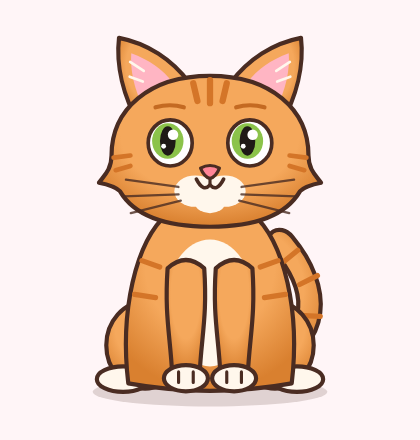
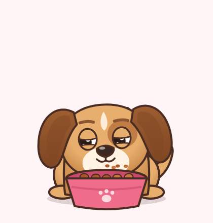
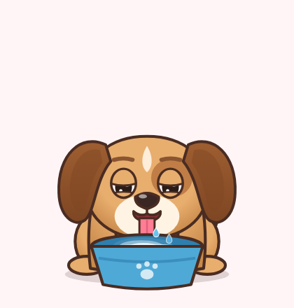
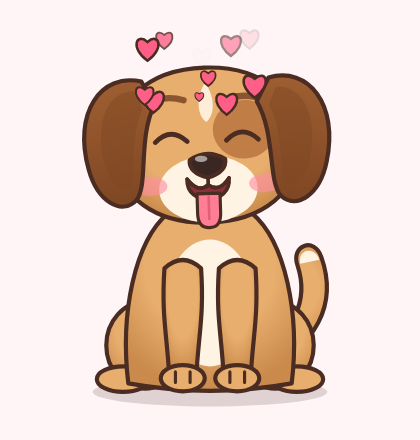
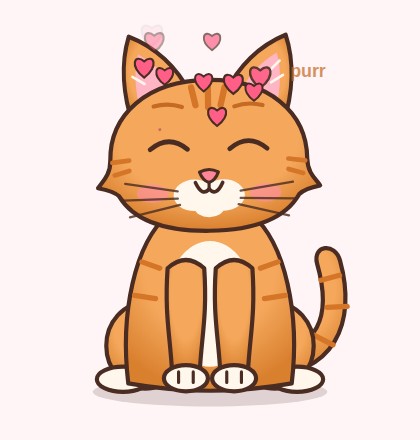
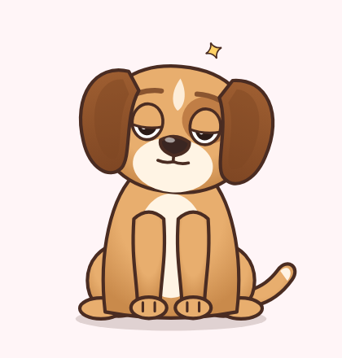
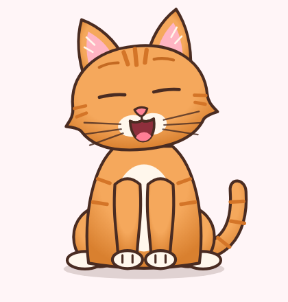
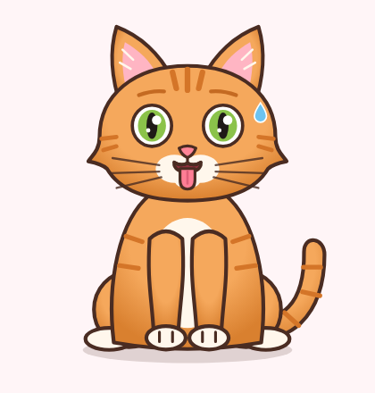

# 🐾 Pet Bakım Mini Oyunu — Animasyon Motoru

Regl takip uygulaması içine eklenecek **köpek ve kedi bakma** mini oyunu için hazır animasyon paketi.
2D, karşıdan görünüm, cartoon tarzı; bütün animasyonlar kod ile (prosedürel) üretilir. Bu yüzden
görüntü her ekran boyutunda keskin kalır ve hareketler yumuşak geçişlerle birbirine bağlanır.

| Köpek | Kedi | Yemek | Su | Sevilme |
|---|---|---|---|---|
|  |  |  |  |  |

| Sevilme (kedi) | Uyku | Yorgun | Esneme | Susamış |
|---|---|---|---|---|
|  |  |  |  |  |

## Neler var?

**Karakter**
- Köpek: sarkık kulaklar (rüzgârda sallanır, ruh haline göre kalkar/düşer), göz lekesi, kuyruk
- Kedi: sivri kulaklar, tekir çizgiler, bıyıklar (sevilince titrer), dikey göz bebeği (mutlulukta büyür)
- Bacaklar düz çubuk değil: omuz, dirsek kıvrımı, bilek ve parmak çizgili patiler; arkada oturan kalça ve arka ayaklar
- Gözler: göz kırpma, etrafa bakma, göz kapakları (uykulu / kısık / mutlu ^^ / uyuyor ‿‿)
- Ağız: gülümseme, somurtma, açılma, dil çıkarma, çiğneme; yanaklar kızarabiliyor
- Nefes alma (uyurken derin, susayınca hızlı soluma)

**Durumlar (ruh hali – istatistiklere göre otomatik)**
| Ruh hali | Ne zaman | Animasyon |
|---|---|---|
| `happy` | tüm değerler yüksek | gülümser, kuyruk hızlı sallanır, arada zıplar, kafa eğer |
| `neutral` | normal | sakin, arada dudak yalar / kafa eğer |
| `hungry` | tokluk < 30 | üzgün kaşlar, karın guruldar (titreme + "gurr"), dudak yalar |
| `thirsty` | su < 30 | dili dışarıda hızlı soluma, ter damlası |
| `tired` | enerji < 25 | yarı kapalı gözler, sarkık kulak ve kafa, sık sık esneme |
| `sad` | mutluluk < 30 | somurtma, kulaklar ve kuyruk aşağıda, iç çekme |
| `sleeping` | uyutulunca | yere yatar, gözler kapalı, Zzz, derin nefes |

**Aksiyonlar**
| Aksiyon | Açıklama | Etkisi |
|---|---|---|
| `feed()` | Mama kabı gelir, kafasını eğip yer, çiğner, kırıntılar uçar, dudaklarını yalar | tokluk +35, mutluluk +5 |
| `giveWater()` | Su kabı gelir, diliyle lap lap içer, halkalar ve damlalar | su +40, mutluluk +3 |
| `sleep()` | Esner, yatar ve uyur | uyurken enerji dolar |
| `wake()` | Gözlerini yavaşça açar, kalkar, gerinip esner | — |
| Parmakla sevme | Parmağı hayvanın üstünde gezdirince: gözler ^^, yanaklar pembe, kafa parmağa doğru eğilir, kalpler çıkar. Köpek dil çıkarıp kuyruk sallar, kedi mırlar ("purr") | mutluluk artar |
| Dokunma | Kafaya dokununca mutlu tepki, gövdeye dokununca zıplar; uyurken dokunulursa uykusunda gülümser | mutluluk +1 |
| `celebrate()` | Zıplayarak sevinir, yıldız ve kalpler (ör. kullanıcı günlük kaydını girince) | — |
| `play(name)` | Herhangi bir animasyonu elle oynat: `yawn`, `growl`, `lickLips`, `sigh`, `headTilt`, `hop`, `boop` … | — |

Uyurken besleme veya su verme denenirse önce uyanır, sonra yer/içer. Enerji 100 olunca kendiliğinden uyanır (`autoWake`).

## Dosyalar

```
dist/pet.html                       ← TEK DOSYA. WebView'de açılacak sayfa (motor gömülü)
src/pet-engine.js                   ← animasyon motoru (bağımlılık yok)
src/pet.template.html               ← WebView köprüsü (dist/pet.html bundan üretilir)
demo.html                           ← tarayıcıda deneme sayfası (butonlar, istatistik çubukları)
integration/react-native/PetView.tsx + petHtml.js
integration/flutter/pet_view.dart
tools/build.js                      ← src değişince: node tools/build.js
```

## Hızlı deneme

`demo.html` dosyasını tarayıcıda açın. Zaman hızı kaydırıcısıyla açlık/yorgunluğun ilerleyişini hızlandırabilir,
"Ruh hali test" butonlarıyla her durumu anında görebilirsiniz. Telefonda denemek için:
`npx serve .` → telefondan `http://<bilgisayar-ip>:3000/demo.html`.

## Uygulamaya entegrasyon

Motor saf HTML/SVG/JS olduğu için her platformda **WebView** içinde çalışır.

### React Native / Expo
```bash
npx expo install react-native-webview
```
`integration/react-native/` klasöründeki `PetView.tsx` ve `petHtml.js` dosyalarını projenize kopyalayın:
```tsx
const pet = useRef<PetViewHandle>(null);

<PetView ref={pet} species="cat" style={{ width: '100%', aspectRatio: 400 / 420 }}
  initialState={kayitliDurum}
  onStats={s => AsyncStorage.setItem('pet', JSON.stringify(s))}
  onMood={m => console.log('ruh hali', m)} />

<Button title="Besle" onPress={() => pet.current?.feed()} />
```

### Flutter
`dist/pet.html` → `assets/pet.html` olarak kopyalayın, `webview_flutter` ekleyin, `integration/flutter/pet_view.dart` kullanın:
```dart
final pet = PetController();
PetView(controller: pet, species: 'dog', onStats: (s) => prefs.setString('pet', jsonEncode(s)));
ElevatedButton(onPressed: pet.feed, child: Text('Besle'));
```

### Native (Swift / Kotlin)
- `dist/pet.html` dosyasını uygulama paketine ekleyip WKWebView / Android WebView ile yükleyin.
- Komut göndermek: `webView.evaluateJavaScript("petCommand({type:'feed'})")`
- Olay almak: iOS'ta `petBridge` adlı `WKScriptMessageHandler`, Android'de `addJavascriptInterface(obj, "AndroidPet")` (`postMessage(String)` metodu ile).
- Arka planı şeffaf yapın (iOS: `isOpaque = false`, Android: `setBackgroundColor(Color.TRANSPARENT)`).

### Web / iframe
```html
<div id="pet" style="width:300px;height:315px"></div>
<script src="src/pet-engine.js"></script>
<script>const pet = new PetEngine(document.getElementById('pet'), { species: 'dog' });</script>
```

## Köprü protokolü

**Uygulama → hayvan** (`window.petCommand(json)`):
```js
{type:'feed'} {type:'water'} {type:'sleep'} {type:'wake'} {type:'pet'} {type:'celebrate'} {type:'yawn'}
{type:'play', name:'growl'}
{type:'setSpecies', species:'dog'|'cat'}
{type:'setState', state:{ stats:{fullness, hydration, energy, happiness}, sleeping, lastUpdate }}
{type:'setTimeScale', value: 1}
{type:'setColors', colors:{ fur:'#ccc', dog:{ear:'#555'}, cat:{iris:'#4aa3ff'} }}
{type:'pause'} {type:'resume'} {type:'getState'}
```

**Hayvan → uygulama** (JSON string; `{source:'pet', type, data}`):
| type | data |
|---|---|
| `ready` | ilk durum |
| `stats` | `{species, stats, sleeping, mood, lastUpdate}`, saniyede bir gelir; kaydetmek için ideal |
| `mood` | `{mood, previous}` |
| `action` | `{name:'eat'|'drink'|'sleep'|'wake'|..., phase:'start'|'end'}` |
| `pet` | `{phase:'start'|'end'}` |
| `sleep` / `wake` | `{}` |
| `state` | her komuttan sonra güncel durum |

## Durumu kaydetme (uygulama kapalıyken geçen süre)

`stats` olayıyla gelen objeyi olduğu gibi saklayın (AsyncStorage / SharedPreferences / UserDefaults).
Uygulama yeniden açıldığında `setState(kayıt)` gönderin. İçindeki `lastUpdate` sayesinde aradaki süre
(en fazla 72 saat) hesaplanır: hayvan acıkmış, susamış, yorulmuş olur. Uyurken kapatıldıysa enerjisi dolmuş olur.

## Ayarlar

`new PetEngine(el, options)`:
| Seçenek | Varsayılan | Açıklama |
|---|---|---|
| `species` | `'dog'` | `'dog'` veya `'cat'` |
| `timeScale` | `1` | 1 = gerçek zaman. `3600` → 1 saniye = 1 saat (test için) |
| `autoWake` | `true` | enerji dolunca kendiliğinden uyanır |
| `decay` | `{fullness:6, hydration:8, energy:5, energyRegen:22, happiness:3, lowStatPenalty:3}` | saat başına azalma/artış puanları |
| `colors` | — | renk değiştirme (ör. farklı cins/renk seçenekleri sunmak için) |
| `stats`, `state` | — | başlangıç değerleri |

Varsayılan hızlarla tokluk yaklaşık 8 saatte 80'den 30'a düşer, yani hayvan günde 2-3 kez beslenmek ister.
Oyunun temposunu `decay` ile ayarlayabilirsiniz.

Renk örneği (siyah-beyaz kedi):
```js
pet.setColors({ cat: { fur:'#3a3a3a', furShade:'#222', stripe:'#2a2a2a', light:'#fff', iris:'#f2c94c', brow:'#555' } });
```
