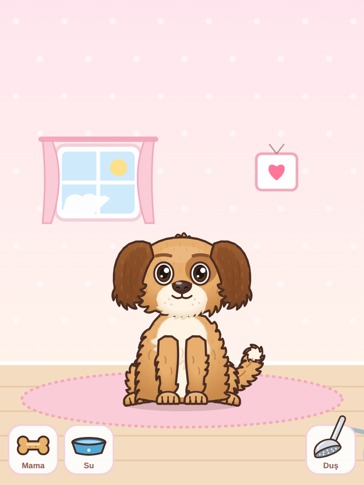
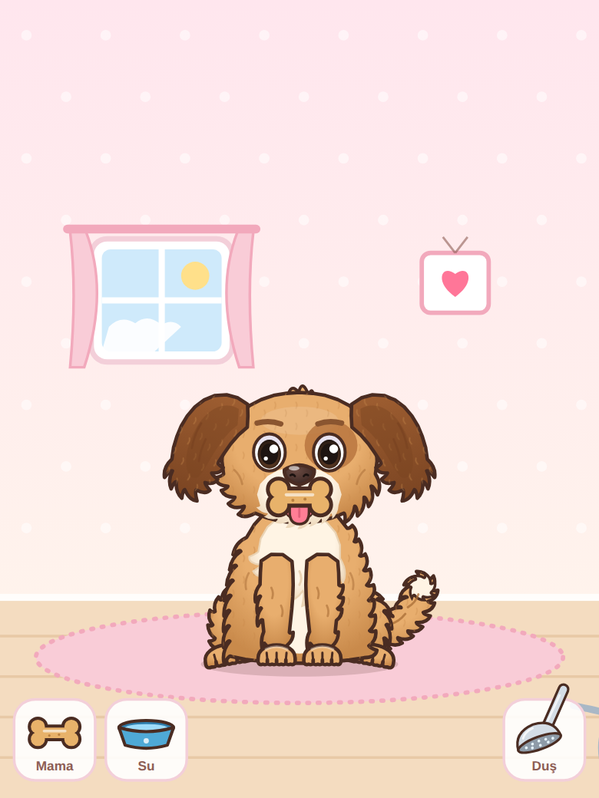
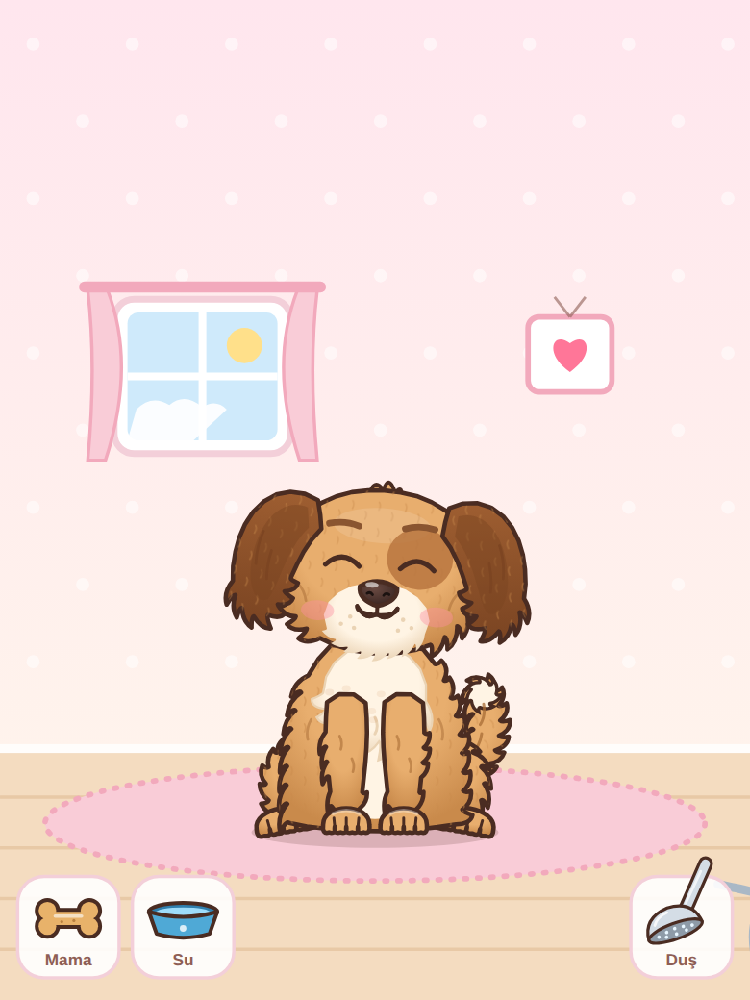
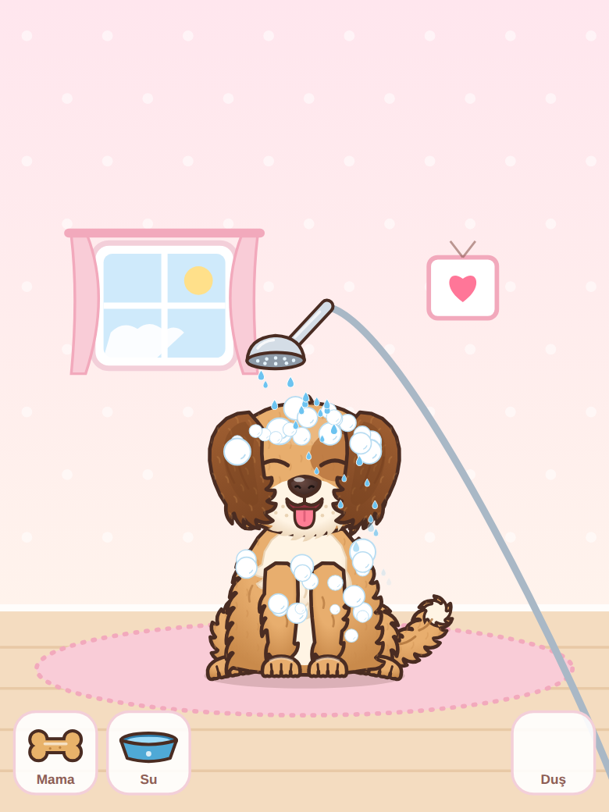
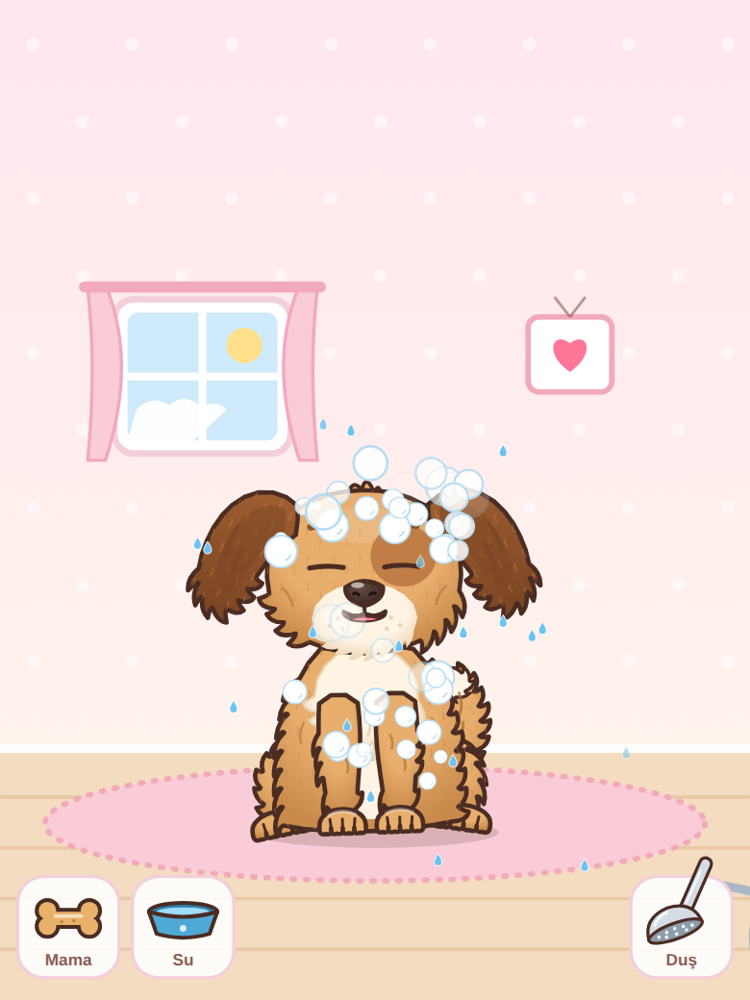
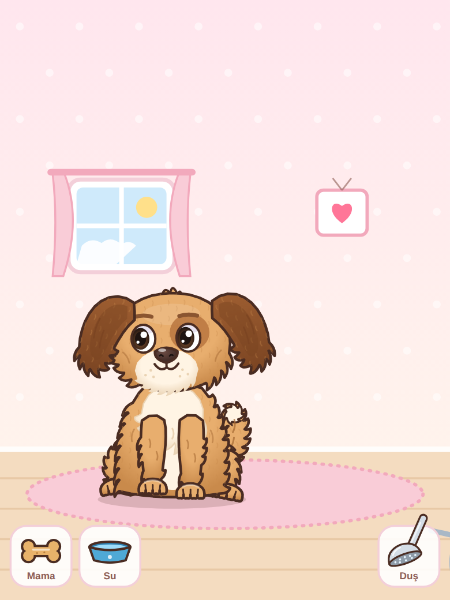
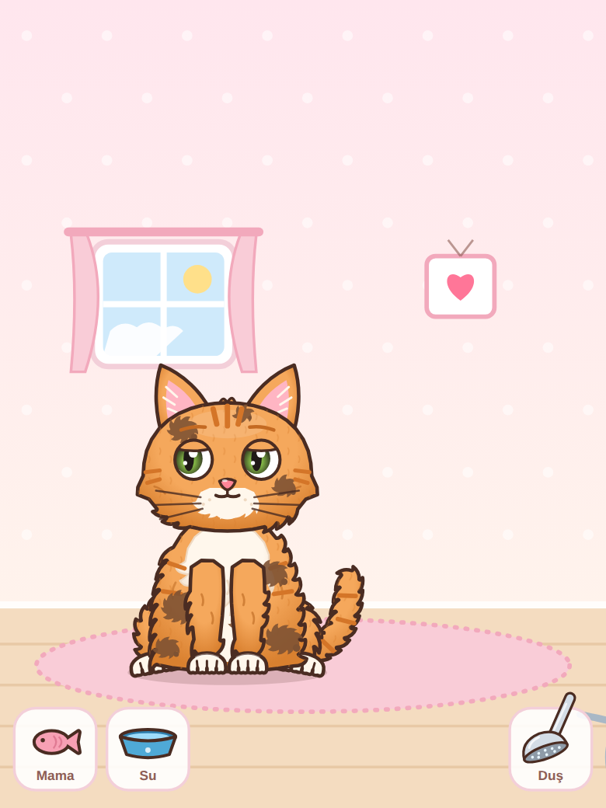
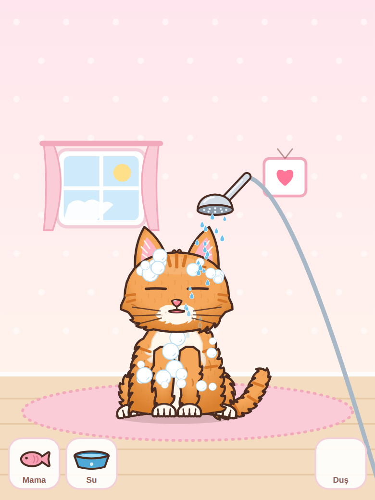
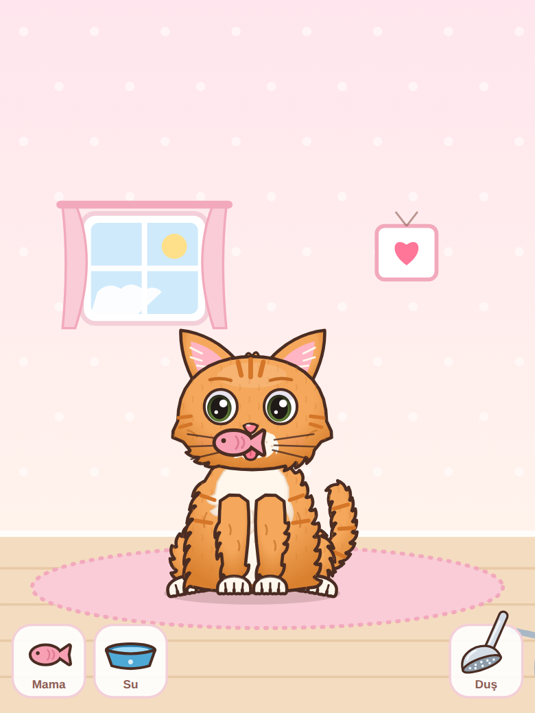
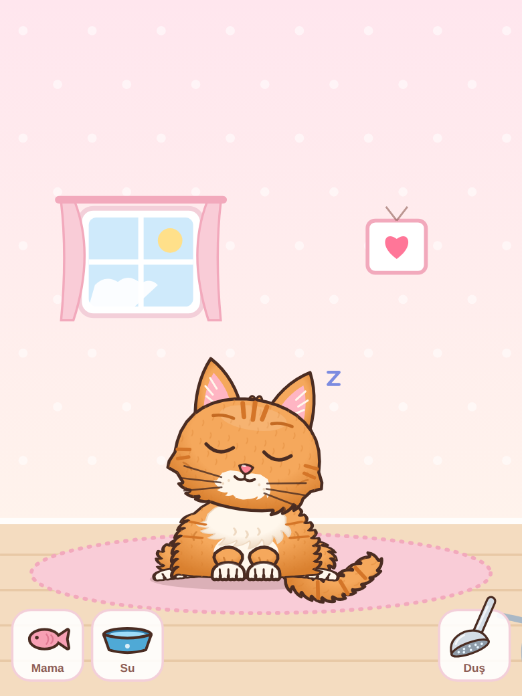

# 🐾 Pet Bakım Mini Oyunu: Animasyon Motoru

Regl takip uygulaması içine eklenecek **köpek ve kedi bakma** mini oyunu için hazır animasyon paketi.
Görünüm 2D, karşıdan bakış ve cartoon tarzında. Tüm animasyonlar kodla üretilir, bu yüzden her ekranda keskin görünür.
Çalışması için tek bir HTML dosyası yeter, dış bağlantı gerekmez.

| Tüylü köpek | Mamayı ağzına götürünce | Yeme | Duş (köpük) | Silkelenme |
|---|---|---|---|---|
|  |  |  |  |  |

| Yürüme | Kirli kedi | Kedi duşta | Kediye mama | Uyku |
|---|---|---|---|---|
|  |  |  |  |  |

## Hızlı deneme (telefonda da)

`demo.html` **tek başına çalışır**, yanında başka dosya gerekmez. Telefona gönderip Chrome ile açabilirsiniz.

> ⚠️ GitHub'da dosyaya tıklamak sayfayı çalıştırmaz, sadece kodunu gösterir. Dosyayı indirip
> tarayıcıda açın ya da bilgisayarda `npx serve .` çalıştırıp telefondan `http://<bilgisayar-ip>:3000/demo.html` adresine girin.

## Oynanış

| Etkileşim | Ne olur |
|---|---|
| **Mama** (sol alt): parmakla sürükleyip **ağzına götür** | Hayvan mamaya bakar, uzaktaysa ona doğru yürür, yaklaştıkça ağzını açar, dil çıkarır, salyası akar. **Bırakınca** mamayı ağzına alır, çiğner, dudaklarını yalar (tokluk +15). Tokken başını çevirip reddeder. |
| **Su** (sol alt): su kabını hayvanın önüne sürükle | Kap önüne konur, diliyle lap lap içer (su +40) |
| **Duş** (sağ alt): duş başlığını **hayvanın üstüne** götür | Su akar, hayvanın kafasında ve gövdesinde köpükler birikir, gözlerini sıkar, kulakları düşer, çamur lekeleri çıkar |
| Duş başlığını **yerine bırak** | Hayvan **silkelenerek kurulanır**: sallanır, etrafa su damlaları saçar, köpükler patlar, tüyleri kabarır, parıltılar çıkar (temizlik = 100) |
| Parmağını hayvanın üstünde gezdir | Sevilme: gözleri ^^ olur, yanakları pembeleşir, kafasını parmağa doğru eğer, kalpler çıkar. Köpek dil çıkarıp kuyruk sallar, kedi mırlar |
| Kafasına dokun | Mutlu tepki verir. Gövdesine dokunursan zıplar |
| Kendiliğinden | Ekranda **sağa sola rastgele yürür**: adım atar, kafasını gittiği yöne çevirir, kulakları sallanır. Ruh haline göre hızlanır ya da yavaşlar, yorgunken çok az yürür |

**Ruh halleri** (istatistiklere göre otomatik): `happy`, `neutral`, `hungry` (karnı guruldar), `thirsty` (dil dışarıda soluma),
`tired` (yarı kapalı gözler, esneme), `dirty` (çamur lekeleri, koku, kaşınma), `sad`, `sleeping` (yatar, Zzz).

**Çizim detayı:** Gövde, kalça, bacaklar, kuyruk, kulaklar ve yanaklarda tüy tutamları var. Göğüste kabarık açık renk tüy, tüy dokusu ve tüy çizgileri de var.
Patilerde 4 parmak çıkıntısı ve parmak çizgileri, bileklerde ve dirseklerde tüy püskülleri bulunuyor.
Gözlerde iris, göz bebeği, parlama ve göz kapakları; burunda burun delikleri var.

## Dosyalar

```
demo.html                          ← TEK DOSYA deneme sayfası (butonlar + istatistikler)
dist/pet.html                      ← TEK DOSYA, uygulamadaki WebView'de açılacak sayfa
integration/android/PetView.kt     ← Android (Kotlin) WebView bileşeni
integration/android/assets/pet.html← app/src/main/assets/ içine kopyalanacak dosya
integration/react-native/          ← React Native / Expo bileşeni
integration/flutter/pet_view.dart  ← Flutter widget'ı
src/pet-engine.js                  ← animasyon motoru (kaynak)
tools/build.js                     ← src değişince: node tools/build.js
```

## Android'e entegrasyon (Kotlin)

1. `integration/android/assets/pet.html` → `app/src/main/assets/pet.html`
2. `integration/android/PetView.kt` dosyasını projeye ekleyin, paket adını değiştirin.
3. Layout ve kod:

```xml
<com.example.pet.PetView
    android:id="@+id/petView"
    android:layout_width="match_parent"
    android:layout_height="480dp" />
```
```kotlin
val prefs = getSharedPreferences("pet", MODE_PRIVATE)
petView.onStats = { json -> prefs.edit().putString("state", json.toString()).apply() }
petView.onMood = { mood -> /* "hungry", "dirty" ... bildirim vb. */ }
petView.load(species = "dog", savedState = prefs.getString("state", null))

// isteğe bağlı butonlar (ekrandaki sürüklenebilir araçlar zaten hazır):
feedBtn.setOnClickListener { petView.feedTreat() }
bathBtn.setOnClickListener { petView.bathe() }
sleepBtn.setOnClickListener { petView.sleep() }
```

React Native ve Flutter için `integration/` klasöründeki dosyalara bakın. Kullanım aynı: `feedTreat()`, `bathe()`, `giveWater()`, `sleep()`, `wake()`.

## Köprü protokolü

**Uygulama → hayvan** (`window.petCommand(json)`):
```js
{type:'treat'}  // elle mama (otomatik ağza götürme)
{type:'feed'}   // mama kabından yeme
{type:'water'} {type:'bath'} {type:'sleep'} {type:'wake'} {type:'pet'} {type:'celebrate'} {type:'yawn'}
{type:'walkTo', x:0.3}          // 0..1 arası konuma yürü
{type:'play', name:'growl'}     // herhangi bir animasyon
{type:'setSpecies', species:'dog'|'cat'}
{type:'setState', state:{ stats:{fullness, hydration, energy, happiness, cleanliness}, sleeping, lastUpdate }}
{type:'setTimeScale', value: 1} {type:'setColors', colors:{...}} {type:'pause'} {type:'resume'} {type:'getState'}
```

**Hayvan → uygulama** (`{source:'pet', type, data}` JSON):
`ready`, `stats` (saniyede bir), `mood`, `action` (`eat`/`drink`/`bath`/`shakeDry`/`sleep`/`wake`… start/end), `drag` (araç sürükleme),
`pet` (sevme başladı/bitti), `sleep`, `wake`, `state`.

## Durumu kaydetme

`stats` olayıyla gelen objeyi saklayın, uygulama açılınca `setState` ile geri verin. `lastUpdate` sayesinde
uygulama kapalıyken geçen süre (en fazla 72 saat) hesaplanır: hayvan acıkmış, susamış, kirlenmiş olur.

## Ayarlar

`new PetEngine(el, options)`:

| Seçenek | Varsayılan | Açıklama |
|---|---|---|
| `species` | `'dog'` | `'dog'` / `'cat'` |
| `tools` | `true` | alt tepsideki Mama / Su / Duş araçları |
| `background` | `true` | oda arka planı (pencere, halı, zemin). `false` → şeffaf |
| `walk` | `true` | ekranda rastgele yürüme |
| `quality` | `'high'` | `'low'` → tüy detayı kapalı (çok eski telefonlar için) |
| `petScale` | `1` | hayvan boyutu |
| `labels` | `{food:'Mama', water:'Su', shower:'Duş'}` | araç yazıları |
| `timeScale` | `1` | test için zamanı hızlandırma (`3600` → 1 sn = 1 saat) |
| `decay` | `{fullness:6, hydration:8, energy:5, energyRegen:22, happiness:3, cleanliness:4}` | saat başına değişim |
| `colors` | — | renkler, ör. `{ cat:{ fur:'#3a3a3a', furShade:'#222', stripe:'#2a2a2a', light:'#fff', iris:'#f2c94c' } }` |

Hayvan alanı en/boy oranına göre kendini ayarlar. **3:4 civarı dikey bir alan** önerilir.
