# Pet Bakım Mini Oyunu: Animasyon Motoru

Regl takip uygulaması için **köpek ve kedi bakma** mini oyunu. Hayvan 2D, karşıdan görünüyor ve cartoon tarzında çizilmiş.
**İki ayağı üstünde duruyor**, kollarını kullanıyor, ekranda yürümüyor.
Her şey tek bir HTML dosyasında çalışıyor, dış bağlantı gerekmiyor.

| Ayakta | Kabı tutup yeme | Ağzını silme | Su içme | Duşta ovalanma |
|---|---|---|---|---|
|  |  |  |  |  |

| Silkelenme | Uyku (oturur) | Demo |
|---|---|---|
|  |  |  |

**23 gerçek cins:**


| Mama menüsü | Oyun: kelebek | Işık kapalı (uyku) | Banyo |
|---|---|---|---|
| 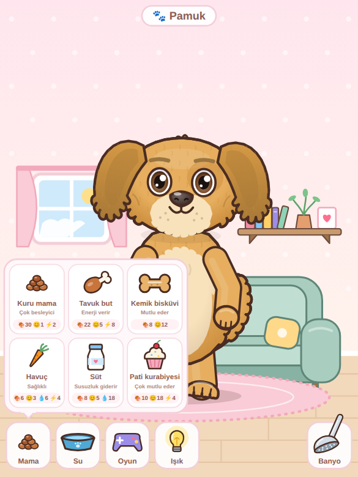 | 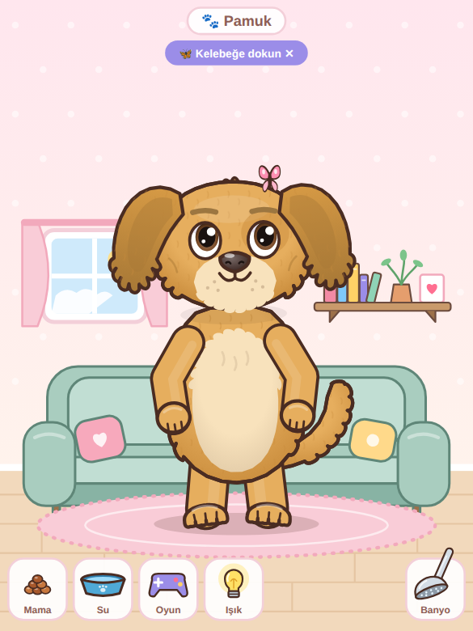 | 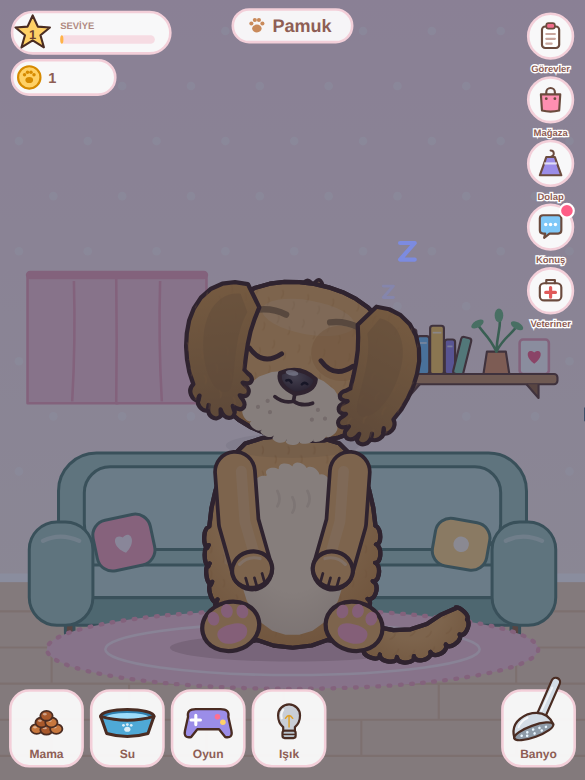 | 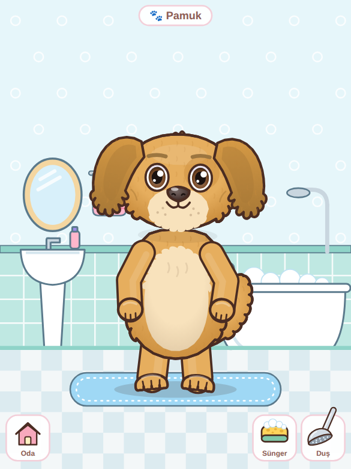 |

| Kıyafetler | Mağaza | Günlük görevler | Saklambaç |
|---|---|---|---|
| 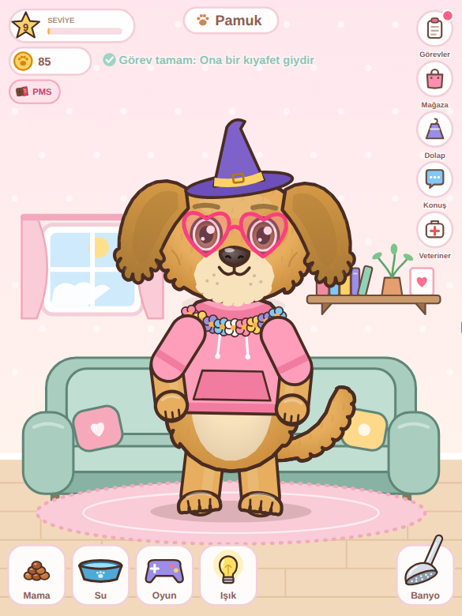 | 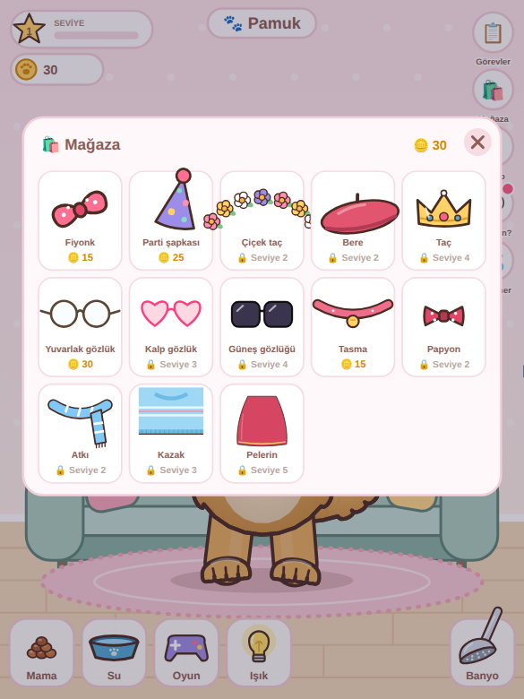 | 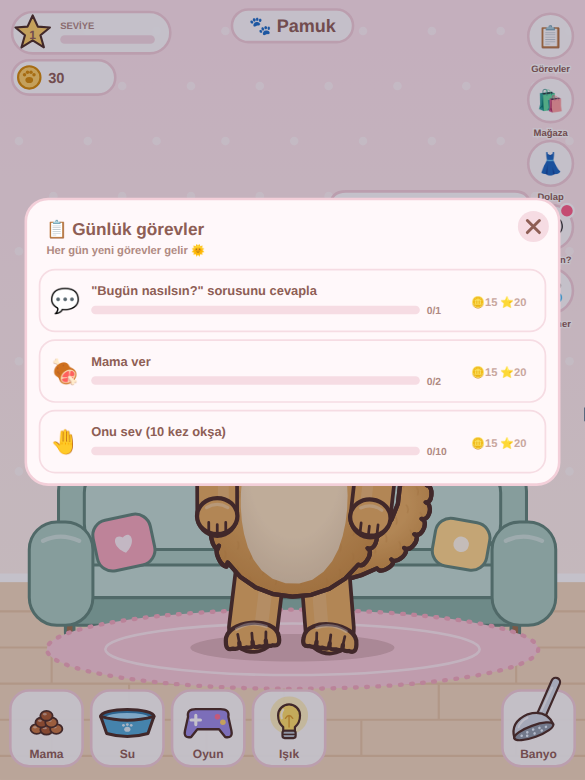 | 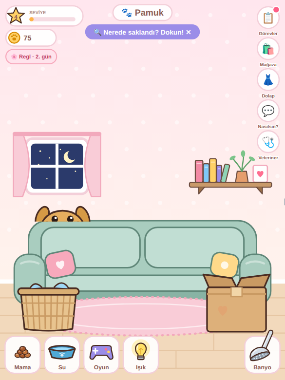 |

| Konuşma: ruh hali | Konuşma: şikayetler | Konuşma: ağrı | Konuşma: ilaç |
|---|---|---|---|
| 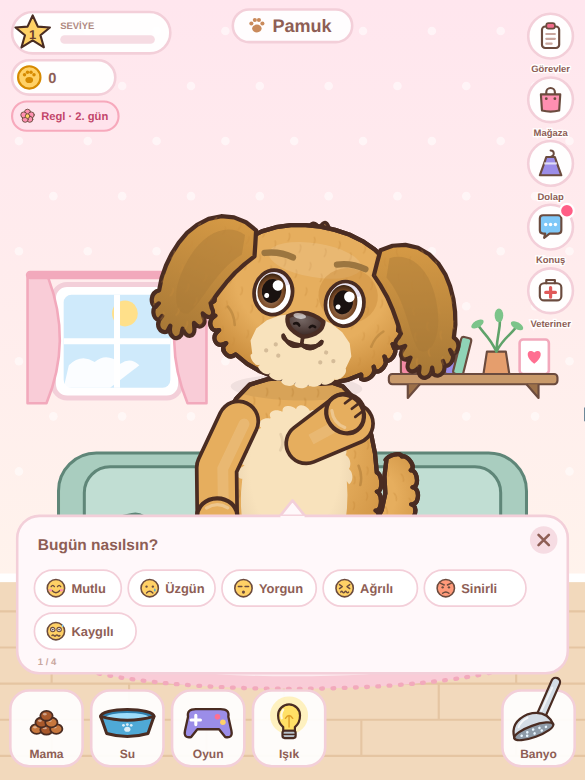 | 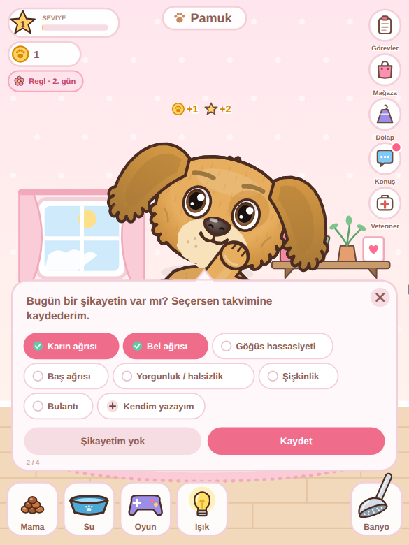 | 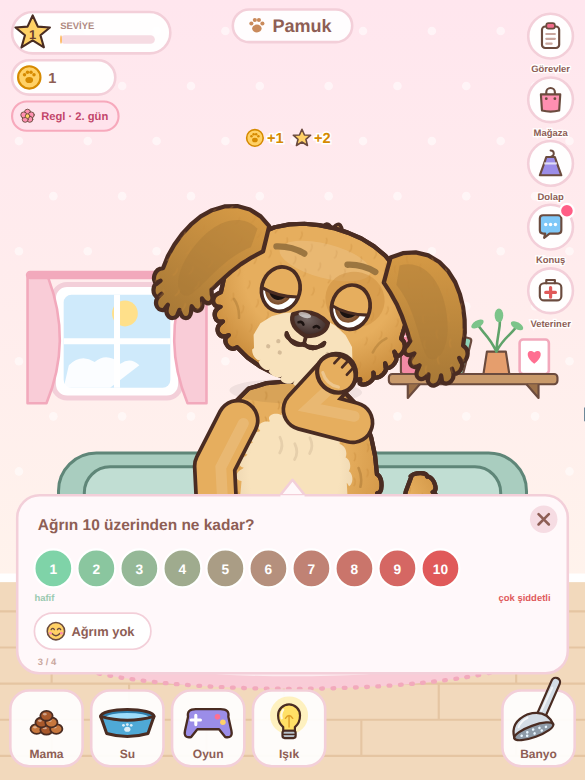 | 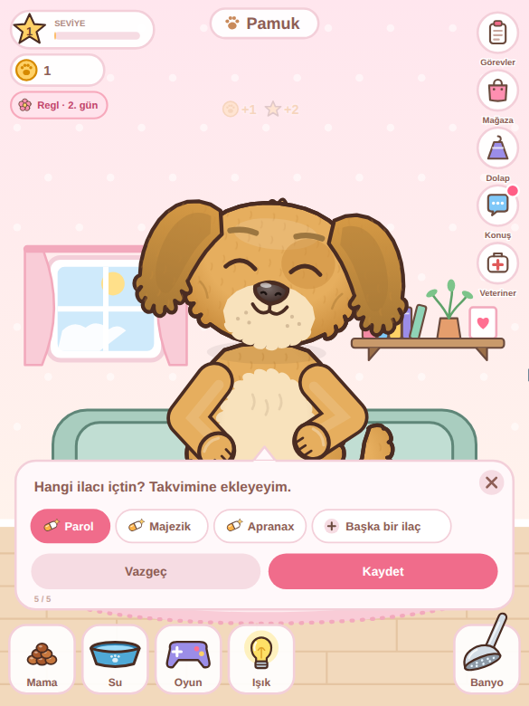 |

| Regl yaklaşıyor | Hasta | Tüy tarama |
|---|---|---|
| 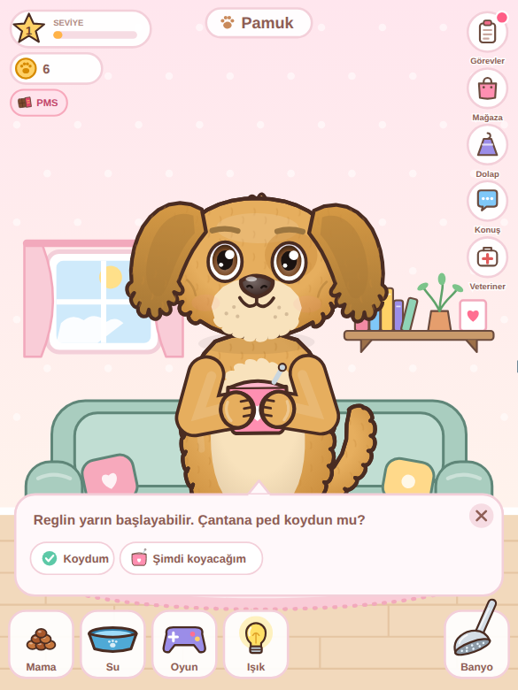 | 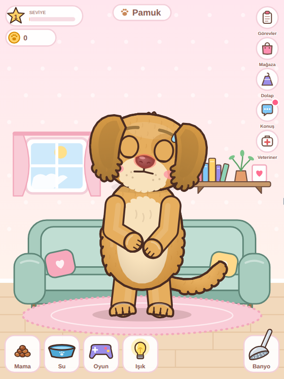 | 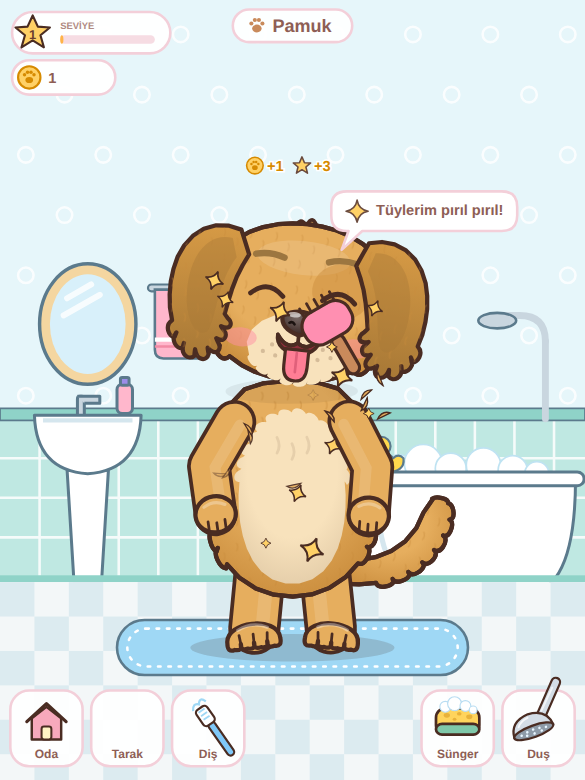 |

**Top oyunu** (patiyle vurma, kafa topu):


## Hızlı deneme

`demo.html` **tek başına çalışır**. Telefona gönderip Chrome ile açabilirsiniz.
GitHub'da dosyaya tıklamak sayfayı çalıştırmaz, sadece kodunu gösterir. Dosyayı indirip açın.

## Oynanış ve kol hareketleri

| Ne yapılır | Hayvan ne yapar |
|---|---|
| **Mama** tuşuna bas | 6 çeşit mamanın olduğu menü açılır. Birini seç ve ağzına sürükle |
| Mamayı ağzına sürükle | Mamaya bakar, iki eliyle uzanır, ağzını açar, salyası akar. Bırakınca mamayı patileriyle tutup ısırarak yer, sonra **patisiyle ağzını siler** ve karnını sıvazlar. Tokken başını çevirir ve eliyle "hayır" yapar |
| **Su** kabını hayvana sürükle | Kabı iki eliyle tutup diliyle içer, sonra ağzını siler |
| **Top**u tutup fırlat | Gözleriyle topu izler. Top tutulurken kollarını açıp hazır bekler. Top yakına gelince patisiyle vurur, kafasının üstüne düşerse kafa atar, yerde ayaklarının yanındaysa tekme atar ("boing!"). Top duvarlardan ve yerden seker |
| **Banyo** tuşuna bas | Ekran sağa kayar, hayvan zıplayarak **banyoya** geçer (küvet, lavabo, ayna, havlu, paspas). Banyoda sadece **Tarak**, **Diş**, **Sünger**, **Duş** ve **Oda** tuşları var; yemek ve oyun yok |
| **Sünger**i hayvanın üstünde gezdir | Her yer köpüklenir. Gözlerini sıkar, kendini ovalar |
| **Duş** başlığını üstüne tut | Su köpükleri durular, köpükler patlar |
| Duş başlığını bırak | Kollarını çırparak **silkelenir**, su saçar, köpükler patlar, tüyleri kabarır, kollarını havaya kaldırıp "tertemiz!" pozu verir |
| Parmağını hayvanın üstünde gezdir | Elleri göğsünde birleşir, sallanır, gözleri ^^ olur, yanakları kızarır. Kedi mırlar |
| Kafasına dokun | Patilerini yanaklarına koyup kıkırdar |
| Karnına dokun | Gıdıklanır |
| **Oyun** tuşuna bas | Top, lazer, baloncuk, kelebek ya da **saklambaç** seç. Üstteki ile oyun biter |
| **Saklambaç** | "3, 2, 1" sayılırken ekran kararır. Hayvan koltuğun arkasına, kutuya ya da çamaşır sepetine saklanır; kulak uçları görünür, ara ara başını uzatır. Doğru yere dokununca ortaya çıkar ve kutlar |
| Banyoda **Tarak** | Tarağı tüylerinde gezdir: gözlerini kapatıp keyif yapar, tüy parçaları uçuşur. Bitince tüyleri bir süre parıldar |
| Banyoda **Diş** fırçası | Fırçayı ağzına götürüp sağa sola oynat: ağzını kocaman açar, dişleri görünür, köpük çıkar. Bitince dişlerini göstererek sırıtır |
| **Işık** (ampul) tuşu | Işık söner, perde kapanır, oda kararır, hayvan uyur. Tekrar basınca ışık yanar ve uyanır |
| Uyut | Esneyip kollarını gerer, **yere oturur** (pembe pati yastıkları görünür), elleri kucağında uyur |
| Uyandır | Gözünü ovuşturur, kalkar, gerinir |

**Kendiliğinden yaptıkları** (ruh haline göre):
- **Mutlu:** el sallar, dans eder, zıplar.
- **Aç:** karnını tutar, karnı guruldar.
- **Yorgun:** gözünü ovuşturur, esner.
- **Susamış:** eliyle yüzünü yelpazeler.
- **Kirli:** kafasını ve karnını kaşır, çamur lekeleri görünür, koku çıkar.
- **Üzgün:** elleri önde birleşik, iç çeker.

## Sağ üstteki butonlar

| Buton | Ne açar |
|---|---|
| **Görevler** | O günün 4 görevi (1 kişisel + 3 bakım). Biten görevin **Ödülü al** butonu: 5 pati parası, 10 deneyim. Dördü de bitince +10 pati parası |
| **Mağaza** | Pati parasıyla kıyafet al. Kafa / Göz / Boyun / Gövde sekmeleri var. Bazı kıyafetler seviye ister |
| **Dolap** | Aldığın kıyafetleri giydir / çıkar |
| **Konuş** | Hayvan sana bugün nasıl olduğunu, şikayetlerini, ağrını ve ilacını sorar (aşağıda) |
| **Veteriner** | Sağlık çubuğu ve ilaçlar: termometre, şurup, vitamin. İlacı ağzına sürükle |

Butonların üstündeki kırmızı nokta: alınacak ödül var / hayvan hasta / bugün henüz konuşulmadı.
Uygulamada hiçbir yerde emoji yok; bütün simgeler SVG olarak çizilir.

## İlk giriş: hayvanını seç

İlk açılışta **Hayvanını seç** penceresi çıkar: Köpek / Kedi, cins (kafa resimleriyle), göz rengi ve isim. İsim verilmeden kaydedilmez.
Daha sonra sağ üstteki **Hayvanım** tuşundan değiştirilebilir. Seçim yapıldıktan sonra yapılan her değişiklikte (cins, göz, isim) uygulamaya `interstitial` olayı gelir; uygulama geçiş reklamı gösterir.

## Mama stoku

Mamalar artık sınırsız değil. Başlangıçta **8 kuru mama** var. Mama menüsünde her mamanın üstünde kaç tane kaldığı yazar, altında paket satın alma düğmesi vardır:

| Mama | Paket | Fiyat |
|---|---|---|
| Kuru mama | 5 adet | 8 pati parası |
| Tavuk but / Ton balığı | 3 adet | 12 |
| Kemik bisküvi / Balık ödülü | 3 adet | 9 |
| Havuç / Kedi otu | 3 adet | 6 |
| Süt | 3 adet | 8 |
| Pati kurabiyesi | 2 adet | 14 |

## Reklam izleyerek pati parası

Mağazada ve mama menüsünde "Reklam izle, 15 pati parası kazan" düğmesi var (günde en fazla 5 kez).
Düğmeye basılınca uygulamaya `adRequest` olayı gelir; uygulama ödüllü reklamı gösterir, kullanıcı sonuna kadar izlerse `{type:'adReward'}`, izlemezse `{type:'adFailed'}` gönderir.

## Pati parası zor kazanılır

Her bakımın **günlük bir sınırı** var. Sınır dolunca bakım yine yapılır, hayvan yine sevinir ama para ve deneyim vermez.
Sayaçlar her gece 12'de sıfırlanır. Örneğin tarak günde yalnızca bir kez ödül verir, sürekli tarayarak para kazanılamaz.

| Ne yapınca | Deneyim | Pati parası | Günde en fazla |
|---|---|---|---|
| Mama yedirmek | 2 | 1 | 3 kez |
| Su içirmek | 2 | 1 | 2 kez |
| Banyo (silkelenene kadar) | 5 | 2 | 1 kez |
| Tüy tarama | 3 | 1 | 1 kez |
| Diş fırçalama (iki fırçalama arası en az 3 saat) | 3 | 1 | 2 kez |
| Saklambaçta bulmak | 3 | 1 | 2 kez |
| Oyunda vuruş | 1 | 0 | 8 kez |
| Sevmek | 1 | 0 | 3 kez |
| Kullanıcı "İçtim" der (su hatırlatma) | 2 | 1 | 4 kez |
| Bugün nasılsın sorusu | 2 | 1 | 1 kez |
| Şikayetlerini hayvana anlatmak | 8 | 4 | 1 kez |
| İçtiği ilacı hayvana söylemek | 3 | 1 | 1 kez |
| Regl yaklaşıyor sorusunu cevaplamak | 2 | 1 | 1 kez |
| Günlük görev ödülü | 10 | 5 | 4 görev |
| Dört görevin hepsi | - | 10 | 1 kez |
| Seviye atlamak | - | 5 | - |

Günde en fazla yaklaşık 45 pati parası kazanılır. Ucuz kıyafetler 40-60, pahalılar 350-450 pati parası.

## Kıyafetler (32 çeşit)

| Yer | Kıyafetler (fiyat / seviye) |
|---|---|
| Kafa | Fiyonk (40/1), Parti şapkası (60/1), Kep (90/2), Bere (100/2), Çiçek taç (110/2), Tavşan kulakları (120/2), Aşçı şapkası (130/3), Kalpli taç bandı (150/4), Yılbaşı şapkası (180/4), Cadı şapkası (200/4), Kovboy şapkası (240/5), Taç (350/6), Prenses tacı (400/7) |
| Göz | Yuvarlak gözlük (70/1), Kare gözlük (90/2), Kalp gözlük (140/3), Yıldız gözlük (170/4), Güneş gözlüğü (220/5) |
| Boyun | Tasma (40/1), Bandana (60/1), Papyon (80/2), Atkı (100/2), Kravat (110/3), Çıngıraklı tasma (120/3), İnci kolye (150/3), Çiçek kolye (160/4) |
| Gövde | Kazak (160/3), Kapüşonlu (180/3), Tütü etek (200/4), Yağmurluk (220/4), Tulum (260/5), Pelerin (450/8) |

Kazak, kapüşonlu ve yağmurlukta kollar da aynı renge boyanır. Her yerden aynı anda bir kıyafet giyilebilir.

## Günlük görev havuzu

Her gün havuzdan 4 görev seçilir: 1 kişisel görev ve 3 bakım görevi. Görevler **gece 12'de** değişir.

- **Kişisel:** Sen de 2 bardak su iç, Sen de 4 bardak su iç, Ona bugün nasıl olduğunu anlat, Bugünkü şikayetlerini ona söyle
- **Bakım:** Mama ver, Gün içinde 3 kez mama ver, Sağlıklı bir şey yedir, Ödül maması ver, Su ver, İki kez su ver, Banyo yaptır, Tüylerini tara, Dişlerini fırçala, Dişlerini sabah ve akşam fırçala, Oyun oyna, Topa 3 kez vurdur, Lazeri 3 kez yakalat, 6 baloncuk patlat, Kelebekle oynat, Saklambaçta onu bul, Onu sev, Işığı kapatıp onu uyut, Ona bir kıyafet giydir, Vitamin ver

Aynı türden iki görev (örneğin "Mama ver" ile "3 kez mama ver") aynı gün gelmez.

## Hastalık ve veteriner

- Yeni bir **Sağlık** değeri var.
- Tokluk, su ya da temizlik çok düşük kalırsa (15'in altı) sağlık yavaş yavaş düşer. İyi bakılınca kendiliğinden düzelir.
- Sağlık 40'ın altına inince hayvan **hasta** olur: burnu kızarır, alnında ter damlası çıkar, halsiz durur, ara ara **hapşırır** ("Hapşu!"). "Kendimi iyi hissetmiyorum" der.
- Veteriner panelindeki ilaçlar:
  - **Termometre:** ağzında bekletir, ateşini söyler ("39,1°C").
  - **Şurup:** "Öğ!" diye yüzünü buruşturur, sağlık +35.
  - **Vitamin:** çiğner, sağlık +15, enerji +8.

## Regl uygulamasıyla bağlantı

**1) Döngü evresi ve regl tahmini.** Uygulama hangi evrede olunduğunu ve regle kaç gün kaldığını hayvana söyler:

```kotlin
petView.setCycle("period", day = 2, daysUntilNext = 26) // period, pms, follicular, ovulation, luteal; null → kapalı
```

| Evre | Hayvan ne yapar |
|---|---|
| `period` (Regl) | Sarılır, **sıcak su torbası** getirir, "Kendine iyi bak, ben yanındayım", "Bol su içmeyi unutma" der |
| `pms` | **Çikolata** uzatır, "Duyguların dalgalıysa bu çok normal" der |
| `follicular` / `ovulation` | Dans eder, "Enerjin yükseliyor!" der |
| `luteal` | "Kendine nazik ol" der |

**Regl yaklaşıyor:** regle 0-2 gün kala hayvan elinde küçük bir çantayla gelir ve sorar: "Reglin yarın başlayabilir. Çantana ped koydun mu?" (Koydum / Şimdi koyacağım).

**2) Hayvanla konuşarak şikayet, ağrı ve ilaç kaydı.** Uygulamada takvimden elle giriş aynen çalışır; artık aynı kayıtlar hayvanla konuşarak da girilebilir:

1. "Bugün nasılsın?" (6 yüz ifadesi)
2. "Bugün bir şikayetin var mı? Seçersen takvimine kaydederim." Uygulamadaki **hazır şikayetler** çıkar, birden fazla seçilebilir. "Kendim yazayım" ile yeni şikayet yazılabilir.
3. Regl / PMS günlerinde ya da bir şikayet seçildiyse: "Ağrın 10 üzerinden ne kadar?" (1-10)
4. Regl günlerinde: "Bugün ağrı kesici ya da başka bir ilaç içtin mi?" Evet / Hayır / Henüz değil (2 saat sonra tekrar sorar)
5. Evet ise: "Hangi ilacı içtin?" Uygulamadaki **hazır ilaçlar** çıkar; "Başka bir ilaç" ile yeni ilaç yazılabilir.

Her cevap (ruh hali dahil: `mood` = happy, sad, tired, pain, angry, anxious) hemen `log` olayıyla uygulamaya gelir ve **o günün takvim kaydına** eklenir:

```kotlin
petView.setLogOptions(symptoms = hazirSikayetler, medications = hazirIlaclar,
    todayIso = "2026-10-06", todaySymptoms = bugunSikayetler, todayPain = bugunAgri, todayMeds = bugunIlaclar)
petView.onLog = { kind, date, value, custom ->
    when (kind) {
        "symptom" -> takvim.sikayetEkle(date, value) // "Karın ağrısı"
        "pain" -> takvim.agriKaydet(date, value.toInt()) // 8
        "medication" -> takvim.ilacEkle(date, value) // "Parol"
    }
}
```

Bugün elle girilmiş kayıtlar `today` ile gönderildiği için hayvan onları tekrar sormaz; daha önce girilen şikayetler listede seçili ve kilitli görünür.
Ağrı 9-10 ise "Böyle sürerse doktora danışmayı düşünebilirsin" der, 6-8 ise sıcak su torbası getirir.

**3) Su hatırlatma.** Varsayılan olarak her 2 saatte bir hayvan bir bardak su uzatır: "Sen de bir bardak su iç [İçtim]". Kullanıcı butona basınca uygulamaya `userWater` olayı gelir.

```kotlin
petView.setWaterReminder(90) // dakika, 0 → kapalı
petView.onUserDrankWater = { waterLog.add(250) }
```

**4) Kullanıcının ruh hali.** Konuşmanın ilk sorusudur; uygulamadan da gönderilebilir: `petView.setUserMood("sad")` (happy, sad, tired, pain, angry, anxious).
Üzgünse sarılır, ağrılıysa sıcak su torbası getirir, sinirliyse "Nefes al… / Nefes ver…" diye nefes egzersizi yaptırır.

## Elora (Expo) uygulamasına ekleme

`integration/expo-elora/` klasöründe hazır: `PetScreen.js`, `pet/petHtml.js` ve `App.js.patch`. Ayrıntılar `integration/expo-elora/KURULUM.md` dosyasında.
Uygulamada üstteki pati butonu ve ana sayfadaki "Pati dostun" kartı hayvanı açar; cevaplar `addNote`, `savePain` ve `addMedication` ile o günün kaydına yazılır.

## Konuşma balonları ve saat

- Hayvan ihtiyacını balonla söyler: "Karnım acıktı!", "Susadım", "Banyo yapmak istiyorum", "Sıkıldım, oynayalım mı?", "Seni çok seviyorum!".
- `pet.say('Merhaba!', 3)` ile kendiniz de konuşturabilirsiniz.
- Pencere **telefonun saatine** göre değişir: sabah turuncu, öğlen mavi, akşam gün batımı, gece ay ve yıldızlar. Saat 23'ten sonra ışık açıksa "Geç oldu, uyuyalım mı?" der.

## Mamalar

| id | Köpek | Kedi | Etkisi |
|---|---|---|---|
| `kibble` | Kuru mama | Kuru mama | 30 1 2 (çok besleyici) |
| `meat` | Tavuk but | Ton balığı | 22 5 8 (enerji verir) |
| `treat` | Kemik bisküvi | Balık ödülü | 8 12 (mutlu eder) |
| `veggie` | Havuç | Kedi otu | 6 3 6 4 (sağlıklı) |
| `milk` | Süt | Süt | 8 5 18 (susuzluk giderir) |
| `cake` | Pati kurabiyesi | Pati kurabiyesi | 10 18 4 (çok mutlu eder) |

 tokluk, mutluluk, su, enerji. `pet.getFoods()` listeyi verir.

## Sesler ve isim

- Ses efektleri telefonda üretilir, ses dosyası gerekmez: yeme (çıtırtı), su içme (şapırtı), köpük, duş suyu, silkelenme, topa vurma, baloncuk patlaması, havlama/miyavlama, horlama. Tuşlara basınca ses çıkmaz.
- Telefonlar sesi ancak kullanıcı ekrana bir kez dokunduktan sonra açar. Bu normaldir.
- `pet.setSound(false)` sesi kapatır.
- `pet.setName('Pamuk')` hayvanın üstünde isim etiketi gösterir. İsim `stats` ile birlikte kaydedilir.
- `PetEngine.headThumb('van')` cinsin kafa resmini SVG olarak verir (cins seçme ekranı için).

## Özelleştirme

**Köpek cinsleri:** Golden Retriever, Kangal, Dalmaçyalı, Sibirya Kurdu (Husky), İngiliz Bulldog, Beagle, Pug, Siyah Labrador, Border Collie, Shiba Inu, Rottweiler, Pomeranian

**Kedi cinsleri:** Sarman (Tekir), Van Kedisi, Ankara Kedisi, British Shorthair, Siyam, Smokin (Siyah-Beyaz), Üç Renkli (Calico), Siyah Kedi, Gri Tekir, Maine Coon, Scottish Fold

Her cinsin kendine özgü özellikleri var:
- **Desen:** benek, maske, tekir çizgisi, siyam uçları, Van lekesi, eyer gibi.
- **Kulak:** sarkık, küçük sarkık, dik ya da katlanmış.
- **Tüy yoğunluğu, pati rengi ve varsayılan göz rengi.**

**Göz renkleri:** Kahverengi, Koyu kahve, Ela, Yeşil, Zümrüt, Mavi, Buz mavisi, Kehribar, Sarı, Bakır, Gri, Ela-Mavi (Van tipi iki farklı göz), Mavi-Yeşil

```js
pet.setBreed('kangal'); // cins değiştir
pet.setEyes('iceblue'); // göz rengi (null → cinsin kendi rengi)
pet.getBreeds('cat'); // liste: [{id, name, species, swatch:[renkler]}]
```

| id | Cins | id | Cins |
|---|---|---|---|
| `golden` | Golden Retriever | `tabby` | Sarman (Tekir) |
| `kangal` | Kangal | `van` | Van Kedisi |
| `dalmatian` | Dalmaçyalı | `ankara` | Ankara Kedisi |
| `husky` | Husky | `british` | British Shorthair |
| `bulldog` | İngiliz Bulldog | `siamese` | Siyam |
| `beagle` | Beagle | `tuxedo` | Smokin |
| `pug` | Pug | `calico` | Üç Renkli |
| `labrador` | Siyah Labrador | `black` | Siyah Kedi |
| `collie` | Border Collie | `silver` | Gri Tekir |
| `shiba` | Shiba Inu | `mainecoon` | Maine Coon |
| `rottweiler` | Rottweiler | `scottish` | Scottish Fold |
| `pomeranian` | Pomeranian | | |

## Android'e entegrasyon (Kotlin)

1. `integration/android/assets/pet.html` dosyasını `app/src/main/assets/pet.html` olarak kopyalayın.
2. `integration/android/PetView.kt` dosyasını projeye ekleyin ve paket adını kendi paketinizle değiştirin.

```xml
<com.example.pet.PetView
    android:id="@+id/petView"
    android:layout_width="match_parent"
    android:layout_height="520dp" />
```
```kotlin
val prefs = getSharedPreferences("pet", MODE_PRIVATE)
petView.onStats = { json -> prefs.edit().putString("state", json.toString()).apply() }
petView.load(breed = "golden", savedState = prefs.getString("state", null))

// Kullanıcının seçimlerinden:
petView.setBreed("dalmatian")
petView.setEyes("blue")

// İsteğe bağlı butonlar (ekrandaki sürüklenebilir araçlar zaten hazır):
petView.feedFood("meat"); petView.giveWater(); petView.bathe(); petView.sleep(); petView.wake()
petView.startGame("laser"); petView.stopGame() // ball, laser, bubbles, butterfly
petView.setLights(false); petView.toggleLights() // ışık kapalı → uyur
petView.setName("Pamuk"); petView.setSound(true)
petView.goBath(); petView.goRoom() // banyo sahnesi
petView.brushFur(); petView.brushTeeth() // banyoda tarama / diş fırçalama
petView.giveMedicine("syrup") // thermo, syrup, vitamin
petView.startGame("hide") // saklambaç
petView.openPanel("shop") // quests, shop, wardrobe, vet
petView.startTalk("checkin") // hayvan şikayet / ağrı / ilaç sorar
petView.onEvent = { type, data -> Log.d("pet", "$type $data") }
```

React Native (`integration/react-native/`) ve Flutter (`integration/flutter/`) için de aynı metodlar var.

## Köprü protokolü

**Uygulama → hayvan** (`window.petCommand(json)`):
```js
{type:'treat'} {type:'feed'} {type:'water'} {type:'bath'} {type:'ball'}
{type:'sleep'} {type:'wake'} {type:'pet'} {type:'celebrate'} {type:'yawn'} {type:'play', name:'dance'}
{type:'setBreed', breed:'van'} {type:'setEyes', eyes:'odd'} {type:'setSpecies', species:'cat'}
{type:'getBreeds', species:'dog'}
{type:'feedFood', food:'cake'} {type:'getFoods'}
{type:'game', name:'bubbles'} {type:'stopGame'}
{type:'lights', on:false} {type:'toggleLights'} {type:'scene', scene:'bath'|'room'}
{type:'brushFur'} {type:'brushTeeth'} {type:'medicine', id:'syrup'} {type:'game', name:'hide'}
{type:'cycle', phase:'period', day:2, daysUntilNext:26} {type:'userMood', mood:'sad'}
{type:'logOptions', symptoms:[...], medications:[...], today:{date, symptoms, pain, medications}} {type:'talk', kind:'checkin'|'meds'|'forecast'}
{type:'remindWater'} {type:'waterReminder', minutes:120} {type:'userDrankWater'}
{type:'reward', xp:10, coins:5} {type:'getProgress'} {type:'getShop'} {type:'buy', id:'crown'} {type:'wear', id:'crown'} {type:'unwear', slot:'head'}
{type:'claimQuest', id:'feed'} {type:'panel', name:'shop'} {type:'say', text:'Merhaba!', duration:3} {type:'setHour', hour:21}
{type:'setName', name:'Pamuk'} {type:'sound', on:true} {type:'headThumb', breed:'van'}
{type:'setState', state:{ breed, eyes, stats:{fullness, hydration, energy, happiness, cleanliness}, sleeping, lastUpdate }}
{type:'setTimeScale', value:1} {type:'pause'} {type:'resume'} {type:'getState'}
```

**Hayvan → uygulama** (`{source:'pet', type, data}`):
`ready`, `stats` (saniyede bir; `breed` ve `eyes` dahil, kaydetmek için ideal), `mood`, `action`, `play` (topa vurdu),
`drag`, `pet`, `sleep`, `wake`, `breed`, `breeds`, `state`, `foods`, `headThumb`, `scene`,
`log` (hayvana verilen cevap: `{kind:'symptom'|'pain'|'medication', date, value, custom}`), `checkin`, `talk`, `say`, `level`, `progress`, `quest`, `buy`, `buyResult`, `wear`, `med`, `groom`, `cycle`, `userMood`, `userWater` (kullanıcı "İçtim" dedi), `waterReminder`, `panel`, `shop`.

## Durumu kaydetme

`stats` olayıyla gelen objeyi saklayın, uygulama açılınca `setState` ile geri verin.
Cins, göz rengi, istatistikler, sağlık, seviye, pati parası, kıyafetler, günlük görevler, döngü evresi ve ruh hali birlikte geri yüklenir. `lastUpdate` sayesinde uygulama kapalıyken geçen süre de hesaba katılır.

## Ayarlar

`new PetEngine(el, { breed, eyes, name, sound, tools, hud, clock, waterReminder, background, quality, petScale, labels, timeScale, decay, stats, state })`

| Seçenek | Varsayılan | Açıklama |
|---|---|---|
| `breed` | `'golden'` | yukarıdaki cins id'lerinden biri |
| `eyes` | cinse göre | göz rengi id |
| `tools` | `true` | alt tepsideki Mama / Su / Oyun / Işık / Banyo tuşları |
| `background` | `true` | oda (koltuk, raf, pencere, halı). `false` → şeffaf |
| `quality` | `'high'` | `'low'` → tüy dokusu kapalı (çok eski telefonlar için) |
| `name` | `''` | hayvanın adı |
| `sound` | `true` | ses efektleri |
| `hud` | `tools` ile aynı | sol üstte seviye / para, sağ üstte görev, mağaza, dolap, ruh hali, veteriner butonları |
| `clock` | `true` | pencere telefonun saatine göre sabah / akşam / gece olur |
| `waterReminder` | `120` | su hatırlatma aralığı (dakika). `0` → kapalı |
| `setup` | `true` | ilk açılışta hayvan seçme penceresi |
| `waitState` | `false` | `true` ise uygulama `setState` gönderene kadar (en fazla 4 sn) `stats` gönderilmez; kayıt üzerine boş durum yazılmaz (pet.html'de açık) |
| `ask` | `false` | uygulama `logOptions` göndermese de hayvan günde bir kez kendiliğinden sorsun |
| `labels` | `{food:'Mama', water:'Su', game:'Oyun', light:'Işık', bath:'Banyo', home:'Oda', sponge:'Sünger', shower:'Duş', brush:'Tarak', tooth:'Diş'}` | tuş yazıları |

Önerilen alan oranı **3:4 civarı dikey**.
