# 🐾 Pet Bakım Mini Oyunu: Animasyon Motoru

Regl takip uygulaması için **köpek ve kedi bakma** mini oyunu. Hayvan 2D, karşıdan görünüyor ve cartoon tarzında çizilmiş.
**İki ayağı üstünde duruyor**, kollarını kullanıyor, ekranda yürümüyor.
Her şey tek bir HTML dosyasında çalışıyor, dış bağlantı gerekmiyor.

| Ayakta | Kabı tutup yeme | Ağzını silme | Su içme | Duşta ovalanma |
|---|---|---|---|---|
| 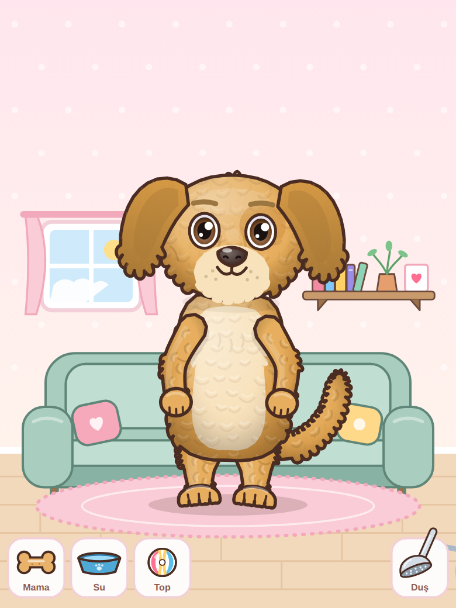 | 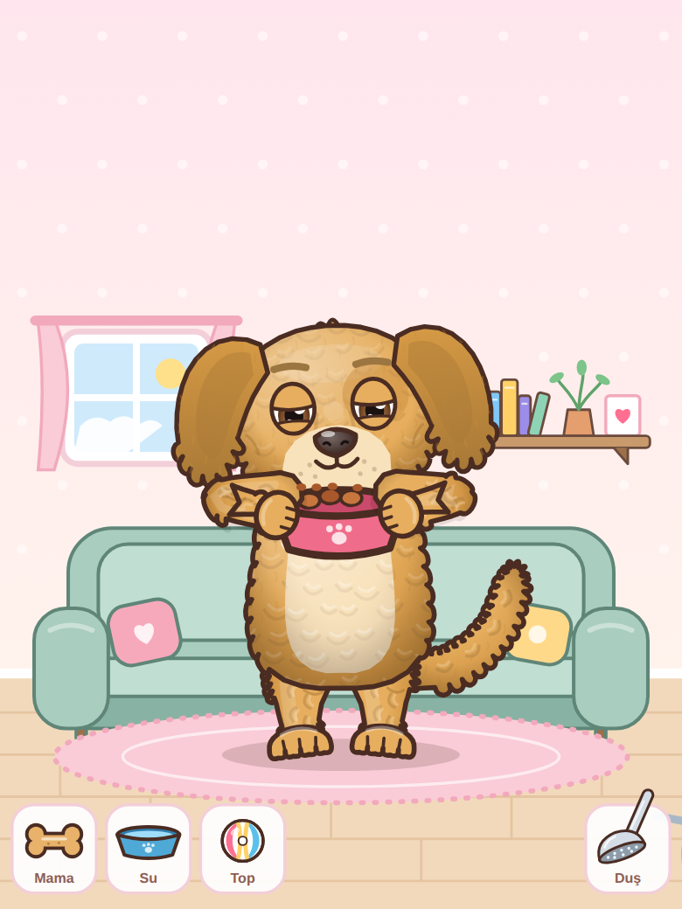 | 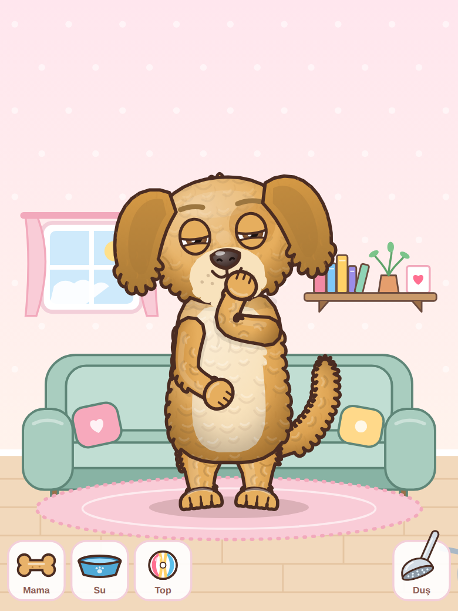 | 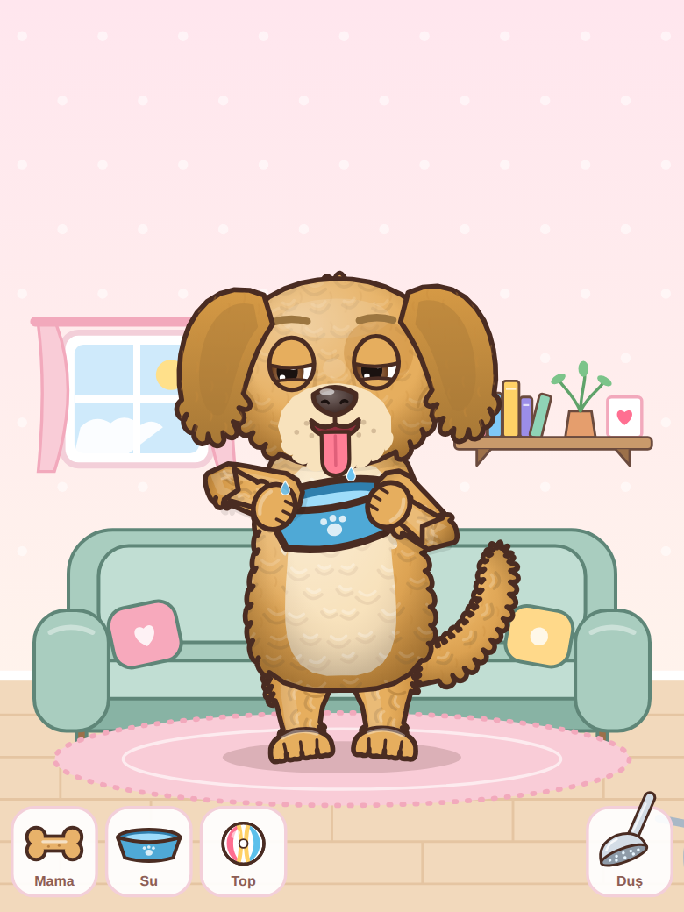 | 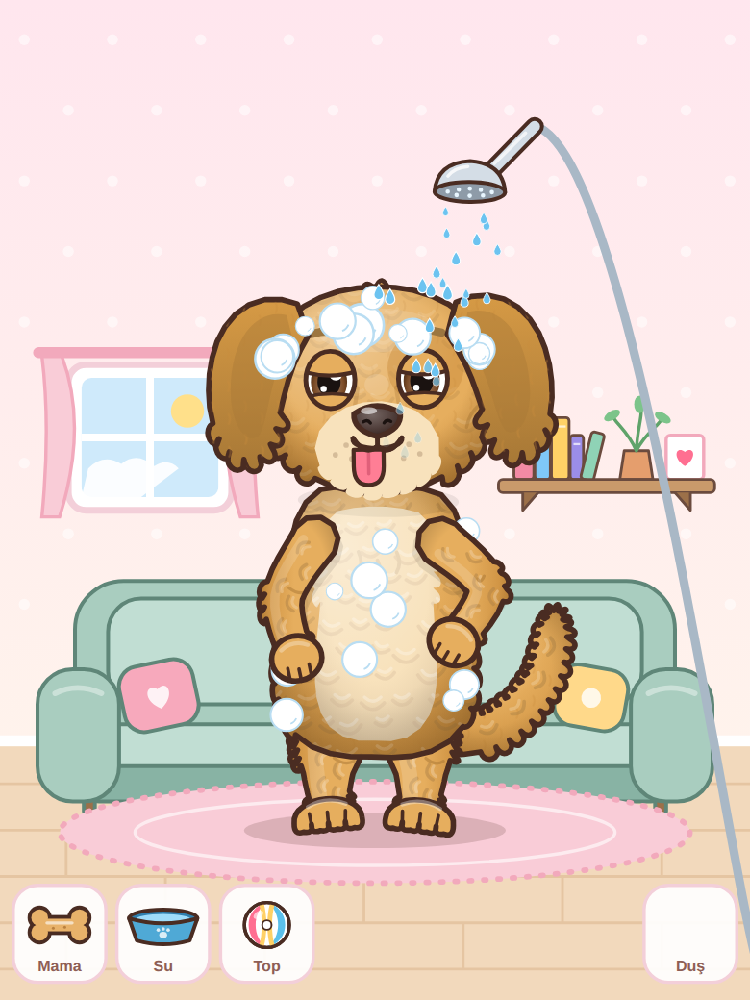 |

| Silkelenme | Uyku (oturur) | Demo |
|---|---|---|
| 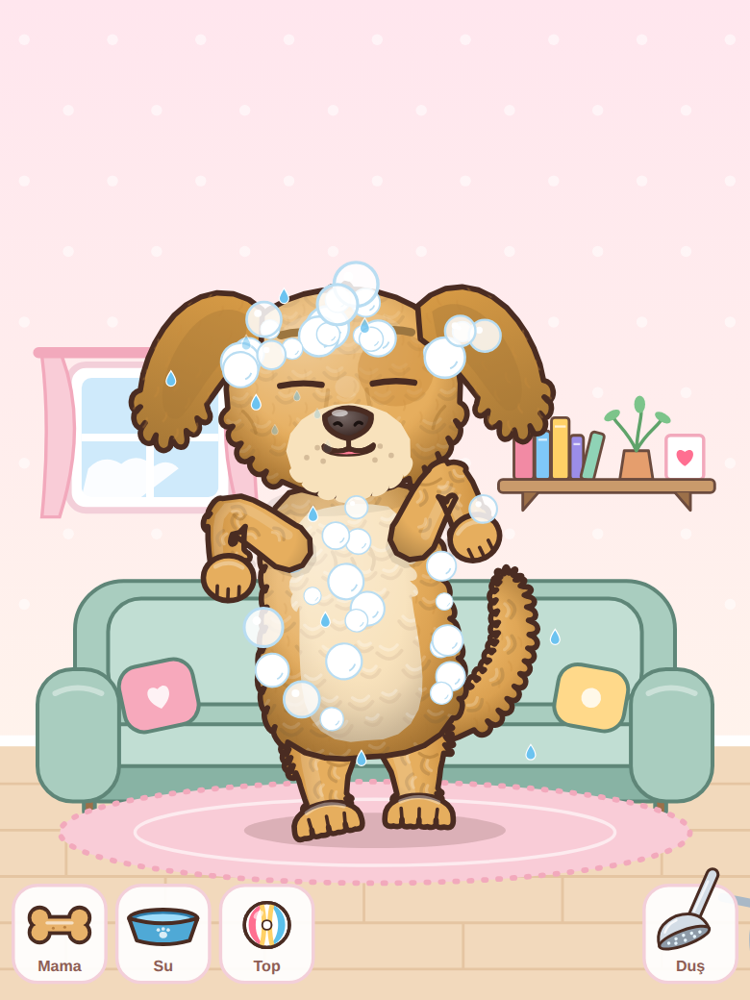 | 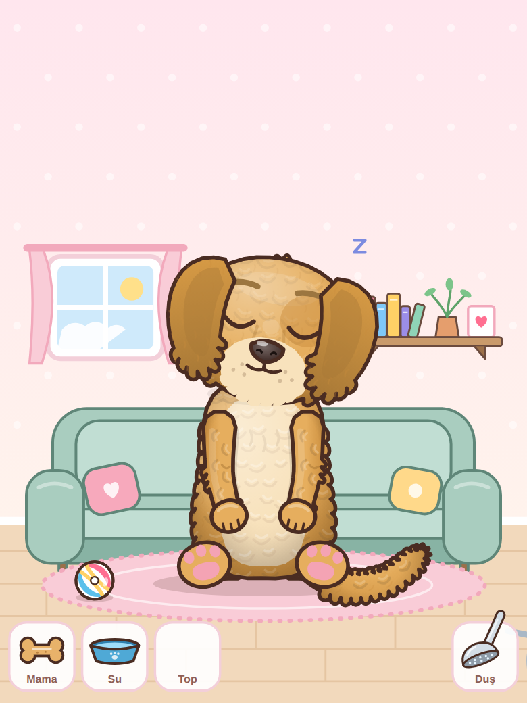 | 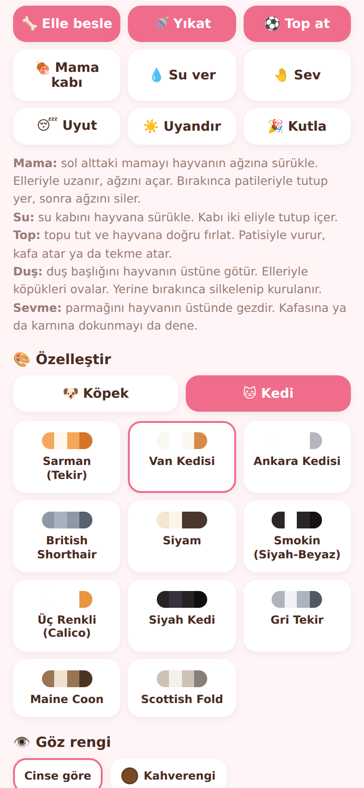 |

**Yakın plan:** Gövde yumuşak, yuvarlak ve pofuduk. Tüylü görünüm sadece dış çizgiden gelmiyor; gövdenin, kafanın, kolların, bacakların ve kuyruğun içinde üst üste binen tüy tutamları var. Her tutamın altında gölge, üstünde parlama var. Bunlara ek olarak sol üstten gelen yumuşak bir ışık, kenarlarda hafif bir koyulaşma ve kolların gövdeye düşen gölgesi var.

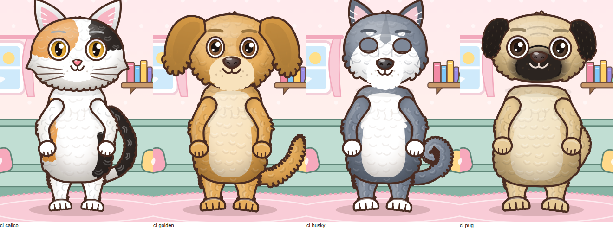

**23 gerçek cins.** Köpeklerde kafa şekli, burun uzunluğu, göz şekli, gövde yapısı ve kuyruk cinse göre değişir:

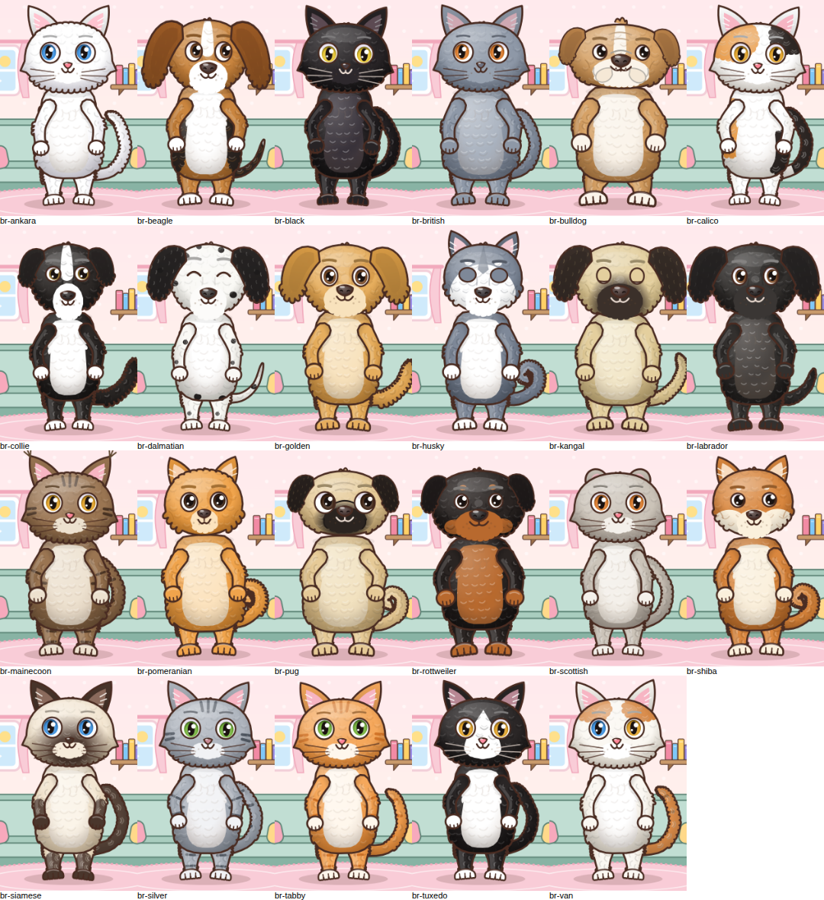

**Top oyunu** (patiyle vurma, kafa topu):

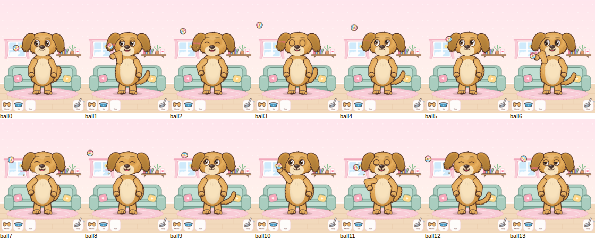

## Hızlı deneme

`demo.html` **tek başına çalışır**. Telefona gönderip Chrome ile açabilirsiniz.
GitHub'da dosyaya tıklamak sayfayı çalıştırmaz, sadece kodunu gösterir. Dosyayı indirip açın.

## Oynanış ve kol hareketleri

| Ne yapılır | Hayvan ne yapar |
|---|---|
| **Mama**yı ağzına sürükle | Mamaya bakar, iki eliyle uzanır, ağzını açar, salyası akar. Bırakınca mamayı patileriyle tutup ısırarak yer, sonra **patisiyle ağzını siler** ve karnını sıvazlar. Tokken başını çevirir ve eliyle "hayır" yapar |
| **Su** kabını hayvana sürükle | Kabı iki eliyle tutup diliyle içer, sonra ağzını siler |
| **Top**u tutup fırlat | Gözleriyle topu izler. Top tutulurken kollarını açıp hazır bekler. Top yakına gelince patisiyle vurur, kafasının üstüne düşerse kafa atar, yerde ayaklarının yanındaysa tekme atar ("boing!"). Top duvarlardan ve yerden seker |
| **Duş**u hayvanın üstüne götür | Gözlerini sıkar, kulaklarını indirir, **elleriyle kafasını ve karnını ovalar**, köpükler birikir |
| Duş başlığını yerine bırak | Kollarını çırparak **silkelenir**, su saçar, köpükler patlar, tüyleri kabarır, kollarını havaya kaldırıp "tertemiz!" pozu verir |
| Parmağını hayvanın üstünde gezdir | Elleri göğsünde birleşir, sallanır, gözleri ^^ olur, yanakları kızarır. Kedi mırlar |
| Kafasına dokun | Patilerini yanaklarına koyup kıkırdar |
| Karnına dokun | Gıdıklanır |
| Uyut | Esneyip kollarını gerer, **yere oturur** (pembe pati yastıkları görünür), elleri kucağında uyur |
| Uyandır | Gözünü ovuşturur, kalkar, gerinir |

**Kendiliğinden yaptıkları** (ruh haline göre):
- **Mutlu:** el sallar, dans eder, zıplar.
- **Aç:** karnını tutar, karnı guruldar.
- **Yorgun:** gözünü ovuşturur, esner.
- **Susamış:** eliyle yüzünü yelpazeler.
- **Kirli:** kafasını ve karnını kaşır, çamur lekeleri görünür, koku çıkar.
- **Üzgün:** elleri önde birleşik, iç çeker.

## Özelleştirme

**Köpek cinsleri:** Golden Retriever, Kangal, Dalmaçyalı, Sibirya Kurdu (Husky), İngiliz Bulldog, Beagle, Pug, Siyah Labrador, Border Collie, Shiba Inu, Rottweiler, Pomeranian

**Kedi cinsleri:** Sarman (Tekir), Van Kedisi, Ankara Kedisi, British Shorthair, Siyam, Smokin (Siyah-Beyaz), Üç Renkli (Calico), Siyah Kedi, Gri Tekir, Maine Coon, Scottish Fold

Her köpek cinsinin gerçek yüz ve vücut hatları var:
- **Bulldog:** geniş ve basık yüz, sarkık yanaklar, alt çene dişleri, iri ve çarpık bacaklı gövde, kısa kuyruk.
- **Pug:** yuvarlak yüz, iri gözler, burun kıvrımı, tombul gövde, kıvrık kuyruk.
- **Border Collie ve Dalmaçyalı:** dar kafa, uzun burun, ince gövde.
- **Kangal:** iri kafa, uzun burun, kara maske, büyük gövde, orak kuyruk.
- **Rottweiler:** geniş kafa, kaslı gövde, kısa kuyruk.
- **Husky ve Shiba:** kurt ve tilki yüzü, kıvrık kuyruk.
- **Beagle:** uzun sarkık kulaklar.
- **Pomeranian:** minik burun, kabarık gövde.

Kedilerde British Shorthair ve Maine Coon daha iri yapılı.

Her cinsin ayrıca kendine özgü şu özellikleri var:
- **Desen:** benek, maske, tekir çizgisi, siyam uçları, Van lekesi, eyer gibi.
- **Kulak:** sarkık, küçük sarkık, dik ya da katlanmış.
- **Tüy yoğunluğu, pati rengi ve varsayılan göz rengi.**

**Göz renkleri:** Kahverengi, Koyu kahve, Ela, Yeşil, Zümrüt, Mavi, Buz mavisi, Kehribar, Sarı, Bakır, Gri, Ela-Mavi (Van tipi iki farklı göz), Mavi-Yeşil

```js
pet.setBreed('kangal');   // cins değiştir
pet.setEyes('iceblue');   // göz rengi (null → cinsin kendi rengi)
pet.getBreeds('cat');     // liste: [{id, name, species, swatch:[renkler]}]
```

| id | Cins | id | Cins |
|---|---|---|---|
| `golden` | Golden Retriever | `tabby` | Sarman (Tekir) |
| `kangal` | Kangal | `van` | Van Kedisi |
| `dalmatian` | Dalmaçyalı | `ankara` | Ankara Kedisi |
| `husky` | Husky | `british` | British Shorthair |
| `bulldog` | İngiliz Bulldog | `siamese` | Siyam |
| `beagle` | Beagle | `tuxedo` | Smokin |
| `pug` | Pug | `calico` | Üç Renkli |
| `labrador` | Siyah Labrador | `black` | Siyah Kedi |
| `collie` | Border Collie | `silver` | Gri Tekir |
| `shiba` | Shiba Inu | `mainecoon` | Maine Coon |
| `rottweiler` | Rottweiler | `scottish` | Scottish Fold |
| `pomeranian` | Pomeranian | | |

## Android'e entegrasyon (Kotlin)

1. `integration/android/assets/pet.html` dosyasını `app/src/main/assets/pet.html` olarak kopyalayın.
2. `integration/android/PetView.kt` dosyasını projeye ekleyin ve paket adını kendi paketinizle değiştirin.

```xml
<com.example.pet.PetView
    android:id="@+id/petView"
    android:layout_width="match_parent"
    android:layout_height="520dp" />
```
```kotlin
val prefs = getSharedPreferences("pet", MODE_PRIVATE)
petView.onStats = { json -> prefs.edit().putString("state", json.toString()).apply() }
petView.load(breed = "golden", savedState = prefs.getString("state", null))

// Kullanıcının seçimlerinden:
petView.setBreed("dalmatian")
petView.setEyes("blue")

// İsteğe bağlı butonlar (ekrandaki sürüklenebilir araçlar zaten hazır):
petView.feedTreat(); petView.giveWater(); petView.bathe(); petView.throwBall(); petView.sleep(); petView.wake()
```

React Native (`integration/react-native/`) ve Flutter (`integration/flutter/`) için de aynı metodlar var.

## Köprü protokolü

**Uygulama → hayvan** (`window.petCommand(json)`):
```js
{type:'treat'} {type:'feed'} {type:'water'} {type:'bath'} {type:'ball'}
{type:'sleep'} {type:'wake'} {type:'pet'} {type:'celebrate'} {type:'yawn'} {type:'play', name:'dance'}
{type:'setBreed', breed:'van'}  {type:'setEyes', eyes:'odd'}  {type:'setSpecies', species:'cat'}
{type:'getBreeds', species:'dog'}
{type:'setState', state:{ breed, eyes, stats:{fullness, hydration, energy, happiness, cleanliness}, sleeping, lastUpdate }}
{type:'setTimeScale', value:1} {type:'pause'} {type:'resume'} {type:'getState'}
```

**Hayvan → uygulama** (`{source:'pet', type, data}`):
`ready`, `stats` (saniyede bir; `breed` ve `eyes` dahil, kaydetmek için ideal), `mood`, `action`, `play` (topa vurdu),
`drag`, `pet`, `sleep`, `wake`, `breed`, `breeds`, `state`.

## Durumu kaydetme

`stats` olayıyla gelen objeyi saklayın, uygulama açılınca `setState` ile geri verin.
Cins, göz rengi ve istatistikler birlikte geri yüklenir. `lastUpdate` sayesinde uygulama kapalıyken geçen süre de hesaba katılır.

## Ayarlar

`new PetEngine(el, { breed, eyes, tools, background, quality, petScale, labels, timeScale, decay, stats })`

| Seçenek | Varsayılan | Açıklama |
|---|---|---|
| `breed` | `'golden'` | yukarıdaki cins id'lerinden biri |
| `eyes` | cinse göre | göz rengi id |
| `tools` | `true` | alt tepsideki Mama / Su / Top / Duş araçları |
| `background` | `true` | oda (koltuk, raf, pencere, halı). `false` → şeffaf |
| `quality` | `'high'` | `'low'` → tüy dokusu kapalı (çok eski telefonlar için) |
| `labels` | `{food:'Mama', water:'Su', ball:'Top', shower:'Duş'}` | araç yazıları |

Önerilen alan oranı **3:4 civarı dikey**.
