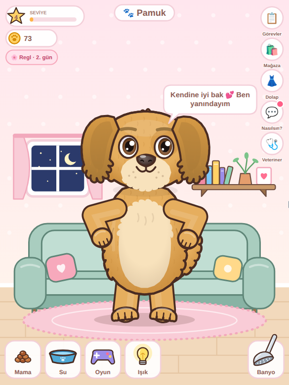
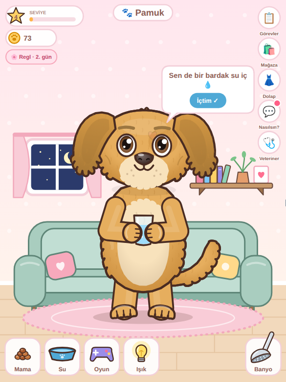

# 🐾 Pet Bakım Mini Oyunu: Animasyon Motoru

Regl takip uygulaması için **köpek ve kedi bakma** mini oyunu. Hayvan 2D, karşıdan görünüyor ve cartoon tarzında çizilmiş.
**İki ayağı üstünde duruyor**, kollarını kullanıyor, ekranda yürümüyor.
Her şey tek bir HTML dosyasında çalışıyor, dış bağlantı gerekmiyor.

| Ayakta | Kabı tutup yeme | Ağzını silme | Su içme | Duşta ovalanma |
|---|---|---|---|---|
|  |  |  |  |  |

| Silkelenme | Uyku (oturur) | Demo |
|---|---|---|
|  |  |  |

**23 gerçek cins:**


| Mama menüsü | Oyun: kelebek | Işık kapalı (uyku) | Banyo |
|---|---|---|---|
|  |  |  |  |

| Kıyafetler | Mağaza | Günlük görevler | Saklambaç |
|---|---|---|---|
|  |  |  |  |

| Regl günü: sarılma | Su hatırlatma | Hasta | Tüy tarama |
|---|---|---|---|
|  |  |  |  |

**Top oyunu** (patiyle vurma, kafa topu):


## Hızlı deneme

`demo.html` **tek başına çalışır**. Telefona gönderip Chrome ile açabilirsiniz.
GitHub'da dosyaya tıklamak sayfayı çalıştırmaz, sadece kodunu gösterir. Dosyayı indirip açın.

## Oynanış ve kol hareketleri

| Ne yapılır | Hayvan ne yapar |
|---|---|
| **Mama** tuşuna bas | 6 çeşit mamanın olduğu menü açılır. Birini seç ve ağzına sürükle |
| Mamayı ağzına sürükle | Mamaya bakar, iki eliyle uzanır, ağzını açar, salyası akar. Bırakınca mamayı patileriyle tutup ısırarak yer, sonra **patisiyle ağzını siler** ve karnını sıvazlar. Tokken başını çevirir ve eliyle "hayır" yapar |
| **Su** kabını hayvana sürükle | Kabı iki eliyle tutup diliyle içer, sonra ağzını siler |
| **Top**u tutup fırlat | Gözleriyle topu izler. Top tutulurken kollarını açıp hazır bekler. Top yakına gelince patisiyle vurur, kafasının üstüne düşerse kafa atar, yerde ayaklarının yanındaysa tekme atar ("boing!"). Top duvarlardan ve yerden seker |
| **Banyo** tuşuna bas | Ekran sağa kayar, hayvan zıplayarak **banyoya** geçer (küvet, lavabo, ayna, havlu, paspas). Banyoda sadece **Tarak**, **Diş**, **Sünger**, **Duş** ve **Oda** tuşları var; yemek ve oyun yok |
| **Sünger**i hayvanın üstünde gezdir | Her yer köpüklenir. Gözlerini sıkar, kendini ovalar |
| **Duş** başlığını üstüne tut | Su köpükleri durular, köpükler patlar |
| Duş başlığını bırak | Kollarını çırparak **silkelenir**, su saçar, köpükler patlar, tüyleri kabarır, kollarını havaya kaldırıp "tertemiz!" pozu verir |
| Parmağını hayvanın üstünde gezdir | Elleri göğsünde birleşir, sallanır, gözleri ^^ olur, yanakları kızarır. Kedi mırlar |
| Kafasına dokun | Patilerini yanaklarına koyup kıkırdar |
| Karnına dokun | Gıdıklanır |
| **Oyun** tuşuna bas | Top, lazer, baloncuk, kelebek ya da **saklambaç** seç. Üstteki ✕ ile oyun biter |
| **Saklambaç** | "3, 2, 1" sayılırken ekran kararır. Hayvan koltuğun arkasına, kutuya ya da çamaşır sepetine saklanır; kulak uçları görünür, ara ara başını uzatır. Doğru yere dokununca ortaya çıkar ve kutlar |
| Banyoda **Tarak** | Tarağı tüylerinde gezdir: gözlerini kapatıp keyif yapar, tüy parçaları uçuşur. Bitince tüyleri bir süre parıldar |
| Banyoda **Diş** fırçası | Fırçayı ağzına götürüp sağa sola oynat: ağzını kocaman açar, dişleri görünür, köpük çıkar. Bitince dişlerini göstererek sırıtır |
| **Işık** (ampul) tuşu | Işık söner, perde kapanır, oda kararır, hayvan uyur. Tekrar basınca ışık yanar ve uyanır |
| Uyut | Esneyip kollarını gerer, **yere oturur** (pembe pati yastıkları görünür), elleri kucağında uyur |
| Uyandır | Gözünü ovuşturur, kalkar, gerinir |

**Kendiliğinden yaptıkları** (ruh haline göre):
- **Mutlu:** el sallar, dans eder, zıplar.
- **Aç:** karnını tutar, karnı guruldar.
- **Yorgun:** gözünü ovuşturur, esner.
- **Susamış:** eliyle yüzünü yelpazeler.
- **Kirli:** kafasını ve karnını kaşır, çamur lekeleri görünür, koku çıkar.
- **Üzgün:** elleri önde birleşik, iç çeker.

## Sağ üstteki butonlar

| Buton | Ne açar |
|---|---|
| 📋 **Görevler** | Her gün 3 yeni görev (örn. "Mama ver 0/2", "Sen de 2 bardak su iç"). Biten görevin **Ödülü al** butonu: 🪙15 ⭐20. Üçü de bitince +20 🪙 bonus |
| 🛍️ **Mağaza** | Pati parasıyla kıyafet al. Bazı kıyafetler seviye ister (🔒 Seviye 3) |
| 👗 **Dolap** | Aldığın kıyafetleri giydir / çıkar |
| 💬 **Nasılsın?** | Kullanıcının kendi ruh hali; hayvan ona göre destek olur (aşağıda) |
| 🩺 **Veteriner** | Sağlık çubuğu ve ilaçlar: termometre, şurup, vitamin. İlacı ağzına sürükle |

Butonların üstündeki kırmızı nokta: alınacak ödül var / hayvan hasta / bugün ruh hali sorulmadı.

## Seviye, pati parası, kıyafetler

Bakım yaptıkça ⭐ (deneyim) ve 🪙 (pati parası) kazanılır:

| Ne yapınca | Kazanç |
|---|---|
| Mama yedirmek | ⭐5 🪙2 |
| Su içirmek | ⭐4 🪙2 |
| Banyo (silkelenene kadar) | ⭐10 🪙5 |
| Tüy tarama, diş fırçalama | ⭐8 🪙4 |
| Saklambaçta bulmak | ⭐10 🪙5 |
| Oyunda her vuruş | ⭐1 🪙1 |
| Kullanıcı "İçtim ✓" der | ⭐3 🪙2 |
| Günlük görev ödülü | ⭐20 🪙15 |

Seviye atlayınca hayvan kutlar, "Seviye 3 oldum! ⭐" der, +10 🪙 verilir ve yeni kıyafetler açılır.

| id | Kıyafet | Yer | Fiyat | Seviye |
|---|---|---|---|---|
| `bow` | Fiyonk | kafa | 15 | 1 |
| `party` | Parti şapkası | kafa | 25 | 1 |
| `flower` | Çiçek taç | kafa | 40 | 2 |
| `beret` | Bere | kafa | 35 | 2 |
| `crown` | Taç | kafa | 80 | 4 |
| `round` | Yuvarlak gözlük | göz | 30 | 1 |
| `heart` | Kalp gözlük | göz | 45 | 3 |
| `sun` | Güneş gözlüğü | göz | 60 | 4 |
| `collar` | Tasma | boyun | 15 | 1 |
| `bowtie` | Papyon | boyun | 25 | 2 |
| `scarf` | Atkı | boyun | 35 | 2 |
| `sweater` | Kazak (kollu) | gövde | 55 | 3 |
| `cape` | Pelerin | gövde | 90 | 5 |

Her yerden (kafa, göz, boyun, gövde) aynı anda bir kıyafet giyilebilir.

## Hastalık ve veteriner

- Yeni bir **Sağlık** değeri var.
- Tokluk, su ya da temizlik çok düşük kalırsa (15'in altı) sağlık yavaş yavaş düşer. İyi bakılınca kendiliğinden düzelir.
- Sağlık 40'ın altına inince hayvan **hasta** olur: burnu kızarır, alnında ter damlası çıkar, halsiz durur, ara ara **hapşırır** ("Hapşu!"). "Kendimi iyi hissetmiyorum 🤒" der.
- Veteriner panelindeki ilaçlar:
  - **Termometre:** ağzında bekletir, ateşini söyler ("39,1°C 🤒").
  - **Şurup:** "Öğ!" diye yüzünü buruşturur, sağlık +35.
  - **Vitamin:** çiğner, sağlık +15, enerji +8.

## Regl uygulamasıyla bağlantı

**1) Döngü evresi.** Uygulamanız hangi evrede olduğunu bilir, hayvana söyler:

```kotlin
petView.setCycle("period", day = 2)   // period, pms, follicular, ovulation, luteal; null → kapalı
```

| Evre | Hayvan ne yapar |
|---|---|
| `period` (Regl) | Sarılır, **sıcak su torbası** getirir, "Kendine iyi bak 💕 Ben yanındayım", "Karnın ağrıyorsa sıcak su torbası iyi gelir", "Bol su içmeyi unutma 💧" der |
| `pms` | **Çikolata** uzatır, "Duyguların dalgalıysa bu çok normal 💗" der |
| `follicular` / `ovulation` | Dans eder, "Enerjin yükseliyor! 🌱", "Bugün ışıl ışılsın! 🌼" der |
| `luteal` | "Kendine nazik ol 🍂", "Sıcak bir bitki çayı iyi gelebilir 🍵" der |

Sol üstte "🌸 Regl · 2. gün" etiketi görünür. Bu davranışları yaklaşık her dakika bir tekrarlar.

**2) Su hatırlatma.** Varsayılan olarak her 2 saatte bir hayvan bir bardak su uzatır: "Sen de bir bardak su iç 💧 [İçtim ✓]". Kullanıcı butona basınca hayvan kutlar ve uygulamaya `userWater` olayı gelir; bunu su takibine kaydedebilirsiniz.

```kotlin
petView.setWaterReminder(90)            // dakika, 0 → kapalı
petView.remindWater()                   // hemen hatırlat (kendi bildirim saatinizde çağırın)
petView.onUserDrankWater = { waterLog.add(250) }
```

**3) Kullanıcının ruh hali.** 💬 butonundan ya da uygulamadan:

```kotlin
petView.setUserMood("sad")              // happy, sad, tired, pain, angry, anxious
```

| Ruh hali | Hayvan ne yapar |
|---|---|
| 😊 Mutlu | Dans eder, "Mutluluğun bana da geçti 💃" |
| 😢 Üzgün | İki kez sarılır, "Yanındayım, sarılalım mı? 🤗" |
| 😴 Yorgun | Esner, gerinir, "Biraz dinlen, ben buradayım 💤" |
| 😣 Ağrılı | Sıcak su torbası getirir, sarılır, "Geçmiş olsun" |
| 😠 Sinirli | **Nefes egzersizi** yaptırır: kollarını yavaşça kaldırıp indirir, "Nefes al… / Nefes ver…" |
| 😰 Kaygılı | Sarılır, sonra nefes egzersizi, "Her şey yoluna girecek 🌈" |

**4) Kayıt ödülü.** Kullanıcı uygulamaya günlük kaydını girdiğinde hayvana ödül verebilirsiniz:

```kotlin
petView.reward(xp = 10, coins = 5)
```

## Konuşma balonları ve saat

- Hayvan ihtiyacını balonla söyler: "Karnım acıktı! 🍖", "Susadım 💧", "Banyo yapmak istiyorum 🛁", "Sıkıldım, oynayalım mı? 🎾", "Seni çok seviyorum! 💕".
- `pet.say('Merhaba!', 3)` ile kendiniz de konuşturabilirsiniz.
- Pencere **telefonun saatine** göre değişir: sabah turuncu, öğlen mavi, akşam gün batımı, gece ay ve yıldızlar. Saat 23'ten sonra ışık açıksa "Geç oldu, uyuyalım mı? 🌙" der.

## Mamalar

| id | Köpek | Kedi | Etkisi |
|---|---|---|---|
| `kibble` | Kuru mama | Kuru mama | 🍖30 😊1 ⚡2 (çok besleyici) |
| `meat` | Tavuk but | Ton balığı | 🍖22 😊5 ⚡8 (enerji verir) |
| `treat` | Kemik bisküvi | Balık ödülü | 🍖8 😊12 (mutlu eder) |
| `veggie` | Havuç | Kedi otu | 🍖6 😊3 💧6 ⚡4 (sağlıklı) |
| `milk` | Süt | Süt | 🍖8 😊5 💧18 (susuzluk giderir) |
| `cake` | Pati kurabiyesi | Pati kurabiyesi | 🍖10 😊18 ⚡4 (çok mutlu eder) |

🍖 tokluk, 😊 mutluluk, 💧 su, ⚡ enerji. `pet.getFoods()` listeyi verir.

## Sesler ve isim

- Ses efektleri telefonda üretilir, ses dosyası gerekmez: yeme (çıtırtı), su içme (şapırtı), köpük, duş suyu, silkelenme, topa vurma, baloncuk patlaması, havlama/miyavlama, horlama. Tuşlara basınca ses çıkmaz.
- Telefonlar sesi ancak kullanıcı ekrana bir kez dokunduktan sonra açar. Bu normaldir.
- `pet.setSound(false)` sesi kapatır.
- `pet.setName('Pamuk')` hayvanın üstünde isim etiketi gösterir. İsim `stats` ile birlikte kaydedilir.
- `PetEngine.headThumb('van')` cinsin kafa resmini SVG olarak verir (cins seçme ekranı için).

## Özelleştirme

**Köpek cinsleri:** Golden Retriever, Kangal, Dalmaçyalı, Sibirya Kurdu (Husky), İngiliz Bulldog, Beagle, Pug, Siyah Labrador, Border Collie, Shiba Inu, Rottweiler, Pomeranian

**Kedi cinsleri:** Sarman (Tekir), Van Kedisi, Ankara Kedisi, British Shorthair, Siyam, Smokin (Siyah-Beyaz), Üç Renkli (Calico), Siyah Kedi, Gri Tekir, Maine Coon, Scottish Fold

Her cinsin kendine özgü özellikleri var:
- **Desen:** benek, maske, tekir çizgisi, siyam uçları, Van lekesi, eyer gibi.
- **Kulak:** sarkık, küçük sarkık, dik ya da katlanmış.
- **Tüy yoğunluğu, pati rengi ve varsayılan göz rengi.**

**Göz renkleri:** Kahverengi, Koyu kahve, Ela, Yeşil, Zümrüt, Mavi, Buz mavisi, Kehribar, Sarı, Bakır, Gri, Ela-Mavi (Van tipi iki farklı göz), Mavi-Yeşil

```js
pet.setBreed('kangal');   // cins değiştir
pet.setEyes('iceblue');   // göz rengi (null → cinsin kendi rengi)
pet.getBreeds('cat');     // liste: [{id, name, species, swatch:[renkler]}]
```

| id | Cins | id | Cins |
|---|---|---|---|
| `golden` | Golden Retriever | `tabby` | Sarman (Tekir) |
| `kangal` | Kangal | `van` | Van Kedisi |
| `dalmatian` | Dalmaçyalı | `ankara` | Ankara Kedisi |
| `husky` | Husky | `british` | British Shorthair |
| `bulldog` | İngiliz Bulldog | `siamese` | Siyam |
| `beagle` | Beagle | `tuxedo` | Smokin |
| `pug` | Pug | `calico` | Üç Renkli |
| `labrador` | Siyah Labrador | `black` | Siyah Kedi |
| `collie` | Border Collie | `silver` | Gri Tekir |
| `shiba` | Shiba Inu | `mainecoon` | Maine Coon |
| `rottweiler` | Rottweiler | `scottish` | Scottish Fold |
| `pomeranian` | Pomeranian | | |

## Android'e entegrasyon (Kotlin)

1. `integration/android/assets/pet.html` dosyasını `app/src/main/assets/pet.html` olarak kopyalayın.
2. `integration/android/PetView.kt` dosyasını projeye ekleyin ve paket adını kendi paketinizle değiştirin.

```xml
<com.example.pet.PetView
    android:id="@+id/petView"
    android:layout_width="match_parent"
    android:layout_height="520dp" />
```
```kotlin
val prefs = getSharedPreferences("pet", MODE_PRIVATE)
petView.onStats = { json -> prefs.edit().putString("state", json.toString()).apply() }
petView.load(breed = "golden", savedState = prefs.getString("state", null))

// Kullanıcının seçimlerinden:
petView.setBreed("dalmatian")
petView.setEyes("blue")

// İsteğe bağlı butonlar (ekrandaki sürüklenebilir araçlar zaten hazır):
petView.feedFood("meat"); petView.giveWater(); petView.bathe(); petView.sleep(); petView.wake()
petView.startGame("laser"); petView.stopGame()      // ball, laser, bubbles, butterfly
petView.setLights(false); petView.toggleLights()    // ışık kapalı → uyur
petView.setName("Pamuk"); petView.setSound(true)
petView.goBath(); petView.goRoom()                  // banyo sahnesi
petView.brushFur(); petView.brushTeeth()            // banyoda tarama / diş fırçalama
petView.giveMedicine("syrup")                       // thermo, syrup, vitamin
petView.startGame("hide")                           // saklambaç
petView.openPanel("shop")                           // quests, shop, wardrobe, mood, vet
petView.onEvent = { type, data -> Log.d("pet", "$type $data") }
```

React Native (`integration/react-native/`) ve Flutter (`integration/flutter/`) için de aynı metodlar var.

## Köprü protokolü

**Uygulama → hayvan** (`window.petCommand(json)`):
```js
{type:'treat'} {type:'feed'} {type:'water'} {type:'bath'} {type:'ball'}
{type:'sleep'} {type:'wake'} {type:'pet'} {type:'celebrate'} {type:'yawn'} {type:'play', name:'dance'}
{type:'setBreed', breed:'van'}  {type:'setEyes', eyes:'odd'}  {type:'setSpecies', species:'cat'}
{type:'getBreeds', species:'dog'}
{type:'feedFood', food:'cake'} {type:'getFoods'}
{type:'game', name:'bubbles'} {type:'stopGame'}
{type:'lights', on:false} {type:'toggleLights'} {type:'scene', scene:'bath'|'room'}
{type:'brushFur'} {type:'brushTeeth'} {type:'medicine', id:'syrup'} {type:'game', name:'hide'}
{type:'cycle', phase:'period', day:2} {type:'userMood', mood:'sad'}
{type:'remindWater'} {type:'waterReminder', minutes:120} {type:'userDrankWater'}
{type:'reward', xp:10, coins:5} {type:'getProgress'} {type:'getShop'} {type:'buy', id:'crown'} {type:'wear', id:'crown'} {type:'unwear', slot:'head'}
{type:'claimQuest', id:'feed'} {type:'panel', name:'shop'} {type:'say', text:'Merhaba!', duration:3} {type:'setHour', hour:21}
{type:'setName', name:'Pamuk'} {type:'sound', on:true} {type:'headThumb', breed:'van'}
{type:'setState', state:{ breed, eyes, stats:{fullness, hydration, energy, happiness, cleanliness}, sleeping, lastUpdate }}
{type:'setTimeScale', value:1} {type:'pause'} {type:'resume'} {type:'getState'}
```

**Hayvan → uygulama** (`{source:'pet', type, data}`):
`ready`, `stats` (saniyede bir; `breed` ve `eyes` dahil, kaydetmek için ideal), `mood`, `action`, `play` (topa vurdu),
`drag`, `pet`, `sleep`, `wake`, `breed`, `breeds`, `state`, `foods`, `headThumb`, `scene`,
`say`, `level`, `progress`, `quest`, `buy`, `buyResult`, `wear`, `med`, `groom`, `cycle`, `userMood`, `userWater` (kullanıcı "İçtim ✓" dedi), `waterReminder`, `panel`, `shop`.

## Durumu kaydetme

`stats` olayıyla gelen objeyi saklayın, uygulama açılınca `setState` ile geri verin.
Cins, göz rengi, istatistikler, sağlık, seviye, pati parası, kıyafetler, günlük görevler, döngü evresi ve ruh hali birlikte geri yüklenir. `lastUpdate` sayesinde uygulama kapalıyken geçen süre de hesaba katılır.

## Ayarlar

`new PetEngine(el, { breed, eyes, name, sound, tools, hud, clock, waterReminder, background, quality, petScale, labels, timeScale, decay, stats, state })`

| Seçenek | Varsayılan | Açıklama |
|---|---|---|
| `breed` | `'golden'` | yukarıdaki cins id'lerinden biri |
| `eyes` | cinse göre | göz rengi id |
| `tools` | `true` | alt tepsideki Mama / Su / Oyun / Işık / Banyo tuşları |
| `background` | `true` | oda (koltuk, raf, pencere, halı). `false` → şeffaf |
| `quality` | `'high'` | `'low'` → tüy dokusu kapalı (çok eski telefonlar için) |
| `name` | `''` | hayvanın adı |
| `sound` | `true` | ses efektleri |
| `hud` | `tools` ile aynı | sol üstte seviye / para, sağ üstte görev, mağaza, dolap, ruh hali, veteriner butonları |
| `clock` | `true` | pencere telefonun saatine göre sabah / akşam / gece olur |
| `waterReminder` | `120` | su hatırlatma aralığı (dakika). `0` → kapalı |
| `labels` | `{food:'Mama', water:'Su', game:'Oyun', light:'Işık', bath:'Banyo', home:'Oda', sponge:'Sünger', shower:'Duş', brush:'Tarak', tooth:'Diş'}` | tuş yazıları |

Önerilen alan oranı **3:4 civarı dikey**.
